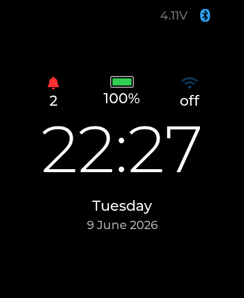
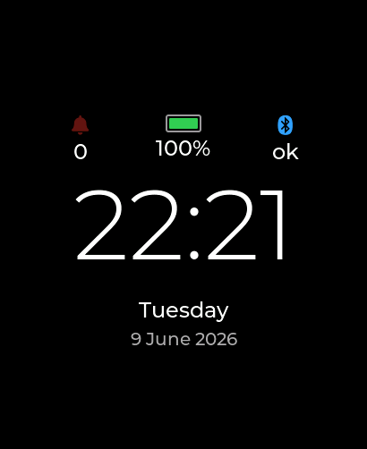
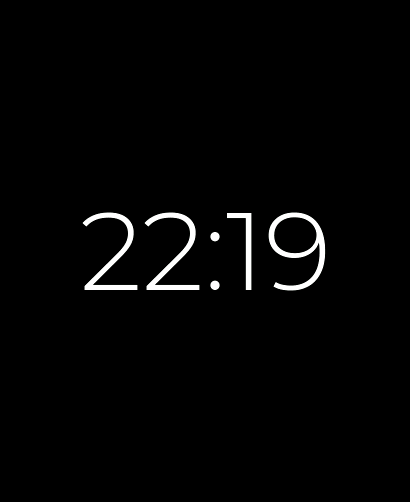
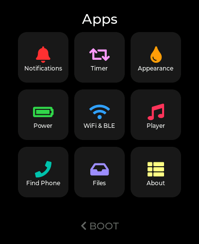
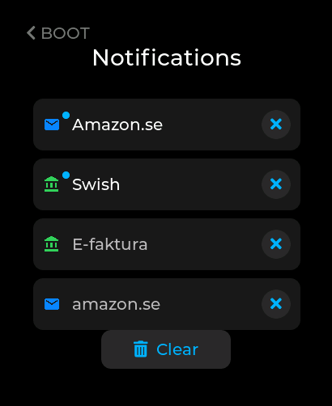
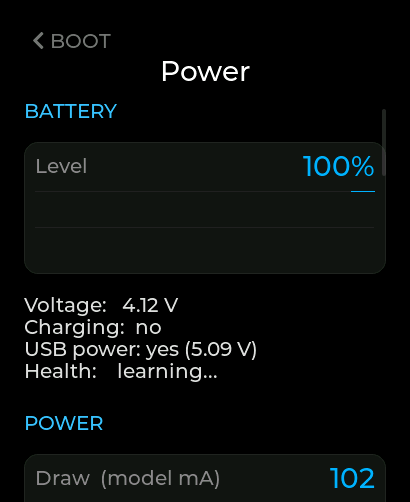
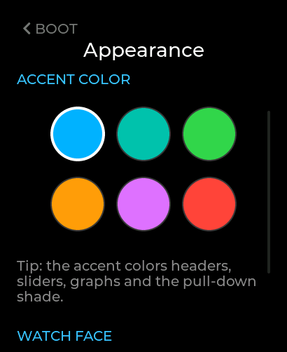
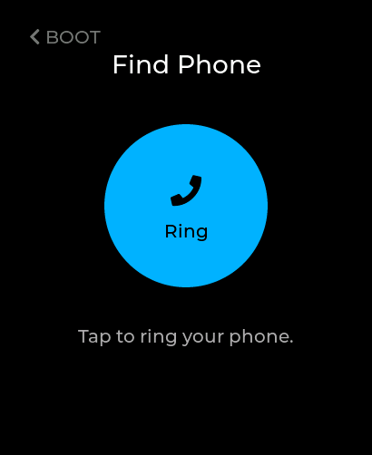

# OpenWatchFace — a small "watch OS"

A from-scratch smartwatch firmware for Waveshare ESP32 touch-display boards. It is a
real little OS in miniature: a watch face, an app launcher, a notification pipeline
that pulls from an HTTPS server **and** from your phone over BLE (iOS via ANCS,
Android via the Gadgetbridge app), deep-sleep power management with a timed
background-fetch wake, and a Player that mirrors and controls iPhone or Android
media — all in a single Arduino translation unit on top of LVGL.

> **Supported hardware:** two boards, selected at compile time via a small board
> abstraction layer (`board.h` + `board_*.h`):
> - **Waveshare ESP32-S3-Touch-AMOLED-2.06** — 410×502 CO5300 AMOLED, FT3168 touch,
>   PCF85063 RTC, **AXP2101 PMU**, 8 MB PSRAM. The original/primary target.
> - **Waveshare ESP32-C6-Touch-LCD-1.47** — 172×320 JD9853 LCD, AXS5106L touch,
>   **no PMU** (battery sensed over an ADC divider), **no PSRAM**, 512 KB SRAM.
>
> The board layer abstracts the pin map, panel/touch drivers, clock/RTC, power
> (PMU vs ADC) and screen geometry, so the same UI builds for both. UI layout that
> diverges is gated on **screen geometry** (portrait/narrow), not on the chip. PSRAM-
> only paths (the screen cache, big LVGL caches) compile out on the C6. Porting to a
> further board means adding a `board_*.h` and its drivers.

---

## Screenshots

<table>
  <tr>
    <td align="center"><br>Watch face</td>
    <td align="center"><br>Watch face (alt)</td>
    <td align="center"><br>Dimmed / minimal face</td>
    <td align="center"><br>App launcher</td>
  </tr>
  <tr>
    <td align="center"><br>Notifications</td>
    <td align="center"><br>Power</td>
    <td align="center"><br>Appearance</td>
    <td align="center"><br>Find Phone</td>
  </tr>
</table>

---

## Table of contents
- [Screenshots](#screenshots)
- [Installation](#installation)
  - [1. Install the Arduino IDE](#1-install-the-arduino-ide)
  - [2. Place the bundled libraries](#2-place-the-bundled-libraries)
  - [3. Install the ESP32 core (Espressif Systems)](#3-install-the-esp32-core-espressif-systems)
  - [4. Unzip the esp32-s3-libs.zip and install it](#4-unzip-the-esp32-s3-libszip-and-install-it)
  - [5. Apply the library patches](#5-apply-the-library-patches)
  - [6. Select your board (board.h + partition file)](#6-select-your-board-boardh--partition-file)
  - [7. Board settings & compile](#7-board-settings--compile)
- [Hardware](#hardware)
- [Architecture overview](#architecture-overview)
- [Deep sleep & the timed wake](#deep-sleep--the-timed-wake)
- [The notification pipeline](#the-notification-pipeline)
  - [Path A — HTTPS notify server](#path-a--https-notify-server)
  - [Path B — iPhone over BLE (ANCS)](#path-b--iphone-over-ble-ancs)
  - [Path C — Android over BLE (Gadgetbridge)](#path-c--android-over-ble-gadgetbridge)
  - [Media control over BLE (AMS)](#media-control-over-ble-ams)
- [Storage (SD card vs flash)](#storage-sd-card-vs-flash)
- [Experimental: overclocking & undervolting](#experimental-overclocking--undervolting)
- [Apps](#apps)
  - [Controls — the BOOT button](#controls--the-boot-button)
- [Build & flash](#build--flash)
- [Repo layout](#repo-layout)
- [Credits & licensing](#credits--licensing)

---

## Installation

Full build guide, start to finish. It targets the Waveshare
**ESP32-S3-Touch-AMOLED-2.06** (the primary board); the **ESP32-C6-Touch-LCD-1.47** is
also supported — pick its board entry and matching settings instead (see the
supported-hardware note above). The steps below show the S3.

This repo ships the **exact library versions** the firmware was built against, in
`libraries/`, so you don't hunt for versions — you copy them into place and
patch them. The only thing installed separately is the ESP32 core itself (it's large and
comes from the Boards Manager).

### 1. Install the Arduino IDE

Install **Arduino IDE 2.x** from <https://www.arduino.cc/en/software> (Windows or Linux).
Launch it once so it creates your sketchbook folder (the place your libraries live):

- **Windows:** `C:\Users\<you>\Documents\Arduino\`
- **Linux:** `~/Arduino/`

> You can confirm/change this path in the IDE under **File → Preferences → Sketchbook
> location**. Everything below assumes the default.

### 2. Place the bundled libraries

Unzip `libraries.zip` into a temporary location.
Place the **contents** of `libraries/` folder into your Arduino
**`libraries/`** folder, so the library folders and `lv_conf.h` land directly inside it.

The result must look like this (note `lv_conf.h` sits **next to** the `lvgl` folder, not
inside it — LVGL requires that):

```
<sketchbook>/libraries/
├── lv_conf.h                     ← must be a sibling of lvgl/
├── lvgl/
├── GFX_Library_for_Arduino/
├── Arduino_DriveBus/
├── SensorLib/
├── XPowersLib/
└── Mylibrary/                    ← board pin map (pin_config.h)
```

**Windows** (PowerShell — adjust the source path to where you cloned this repo):
```powershell
Copy-Item -Recurse -Force ".\libraries\*" `
          "$HOME\Documents\Arduino\libraries\"
```

**Linux** (bash):
```bash
cp -r ./libraries/* ~/Arduino/libraries/
```

> If your `libraries/` folder already has an older `lvgl` / `GFX_Library_for_Arduino`,
> **remove or overwrite** them — the firmware needs these exact versions (LVGL 9.5.0,
> Arduino_GFX 1.6.5; full list in the sketch header).

### 3. Install the ESP32 core (Espressif Systems)

The ESP32 core is **not** bundled (it's large) — install it from the Boards Manager.
**Use the Espressif Systems core, _not_ the legacy "Arduino ESP32 Boards" entry.**

1. **Tools → Board → Board Manager**, search and add:
```
esp32
```
2. Install the entry **"esp32" by Espressif Systems**, version **3.3.8** (pick 3.3.8 in
   the version dropdown — the patches target that exact version).

> ⚠️ There are two similarly-named entries. Choose **esp32 by _Espressif Systems_**.
> Do **not** install "Arduino ESP32 Boards (by Arduino)" — it's a different package and
> the BLE patch path / board definition won't match.

This is also the step that puts the ESP32 core (with its `BLE` library) on disk at:

- **Windows:** `C:\Users\<you>\AppData\Local\Arduino15\packages\esp32\hardware\esp32\3.3.8`
- **Linux:** `~/.arduino15/packages/esp32/hardware/esp32/3.3.8`

You'll point the patch step at that folder next.

### 4. Unzip the esp32-s3-libs.zip and install it

Unzip `esp32-s3-libs.zip` to a temporary location. 
Delete the old directory

**Windows**
```powershell
Remove-Item -Recurse -Force "$env:LOCALAPPDATA\Arduino15\packages\esp32\tools\esp32s3-libs"
```

**Linux**
```bash
rm -rf ~/.arduino15/packages/esp32/tools/esp32s3-libs
```

place the unzipped `esp32-s3-libs` folder inside:
 
**Windows**
```powershell
%LOCALAPPDATA%\Arduino15\packages\esp32\tools\
```

**Linux**
```bash
~/.arduino15/packages/esp32/tools/
```

### 5. Apply the library patches

The firmware relies on modifications to LVGL, Arduino_GFX, and the ESP32
core (its `BLE` and `ESP_I2S` libraries plus `Esp.cpp`). They live outside the sketch, so they must be applied once — without
them the build fails or the watch misbehaves (crash on BLE toggle, single-core
rendering, no screen cache). Full details and a per-patch table are in
[`patches/README.md`](patches/README.md).

The apply scripts **dry-run first and abort without changing anything** if a patch
wouldn't apply cleanly (usually a version mismatch — install the exact versions in steps
2–3), and they're safe to re-run (already-applied patches are skipped).

**Windows** (PowerShell — needs `git` on PATH, which the toolchain provides):
```powershell
cd .\patches
./apply_patches.ps1
```

**Linux** (bash — needs the `patch` tool, e.g. `sudo apt install patch`):
```bash
cd ./patches
./apply_patches.sh ~/Arduino/libraries \
  ~/.arduino15/packages/esp32/hardware/esp32/3.3.8
```

> Prefer to do it by hand? Each patch is a standard `patch -p1` unified diff; see the
> manual instructions in [`patches/README.md`](patches/README.md).

After patching, **clear the Arduino build cache** so the patched libraries recompile
(otherwise a stale cache silently hides the changes):
- **Windows:** delete `%LOCALAPPDATA%\arduino\sketches\*`
- **Linux:** delete `~/.cache/arduino/sketches/*`

### 6. Select your board (board.h + partition file)

Two things in the sketch folder must match the board you're flashing:

**a) Pick the board in `board.h`.** Open `OpenWatchFace/board.h` and set the
`BOARD_SELECT` line to your board:

```c
#define BOARD_SELECT  BOARD_ID_S3_206   // <-- change to your board
//   BOARD_ID_S3_206  — Waveshare ESP32-S3-Touch-AMOLED-2.06
//   BOARD_ID_C6_147  — Waveshare ESP32-C6-Touch-LCD-1.47
```

Everything else (pin map, drivers, PSRAM/PMU feature flags, screen geometry) follows
from that one line.

**b) Put the right partition table in place.** The sketch builds against
`partitions.csv`, but the per-board table ships under a board-specific name. **Copy the
one for your board and rename the copy to `partitions.csv`** (overwrite the existing
one), in the `OpenWatchFace/` folder:

| Board | Copy this file | → rename to |
|---|---|---|
| S3-2.06 | `partitions_s3_32mb.csv` | `partitions.csv` |
| C6-1.47 | `partitions_c6_8mb.csv`  | `partitions.csv` |

**Windows** (PowerShell — S3 shown; use the C6 source for the C6):
```powershell
Copy-Item -Force ".\OpenWatchFace\partitions_s3_32mb.csv" ".\OpenWatchFace\partitions.csv"
```

**Linux** (bash):
```bash
cp -f ./OpenWatchFace/partitions_s3_32mb.csv ./OpenWatchFace/partitions.csv
```

> Both `board.h` **and** the partition file must match the same board — a mismatch
> (e.g. the S3's 32 MB table on the C6's 8 MB flash) fails to flash or boots to a
> black screen.

### 7. Board settings & compile

Open **`OpenWatchFace/OpenWatchFace.ino`** in the Arduino IDE. The **exact
board settings are documented in a comment block at the very top of that file** — set
**Tools →** to match it. For the **S3** that is:

**S3 — ESP32-S3-Touch-AMOLED-2.06:**

| Setting | Value |
|---|---|
| Board | **Waveshare ESP32-S3-Touch-AMOLED-2.06** |
| Erase All Flash Before Sketch Upload | **Enabled** (first flash only) |
| Events Run On | **Core 0** |
| Flash Mode | **QIO 120 MHz** |
| Arduino Runs On | **Core 1** |
| Flash Size | **32MB** (fixed by the board) |
| Partition | **Custom** (uses `partitions.csv` in the sketch folder) |
| PSRAM | **Enabled** |
| Upload Mode | **UART0 / Hardware CDC** |

**C6 — ESP32-C6-Touch-LCD-1.47:**

There's no dedicated board entry for this one, so use the generic **ESP32C6 Dev Module**:

| Setting | Value |
|---|---|
| Board | **ESP32C6 Dev Module** |
| Erase All Flash Before Sketch Upload | **Enabled** (first flash only) |
| Flash Size | **8MB** |
| Partition Scheme | **Custom** (uses `partitions.csv` in the sketch folder) |

> Leave the other ESP32C6 Dev Module options at their defaults. The C6 is single-core
> with no PSRAM, so there are no Core / PSRAM settings to set.

> The **top-of-file comment in the .ino is the source of truth** — if it ever differs
> from this table, follow the file. The custom partition is required: `app0` must stay
> pinned at `0x10000` or the watch boots to a **black screen** (see the .ino note).

Then **Verify** (compile) and **Upload**.

- **First-time clock set:** connect to a WiFi network to sync the RTC automatically,
  or set `FORCE_TIME_SET` to 1, set your current time, and flash. The PCF85063 RTC
  is battery-backed and keeps time after that (NTP re-syncs it whenever WiFi is up,
  and an Android phone pushes time over BLE on every Gadgetbridge connect).
- **Upload trouble?** Hold **BOOT**, tap **RST**, release **BOOT** → download mode, then
  upload again.
- **microSD recommended:** format a card FAT32 and insert it for notification history,
  WiFi credentials, and battery-health logging (the watch falls back to on-flash storage
  without one — see [Storage](#storage-sd-card-vs-flash)).

---

## Hardware

### S3 — ESP32-S3-Touch-AMOLED-2.06 (primary)

| Part | Chip | Bus | Notes |
|------|------|-----|-------|
| MCU | ESP32-S3R8 | — | dual-core LX7, 8 MB OPI PSRAM, 512 KB internal SRAM, 32 MB flash |
| Display | CO5300 AMOLED 410×502 | QSPI @ 80 MHz | command-driven (no autonomous scan-out) |
| Touch | FT3168 capacitive | I²C | shared bus |
| RTC | PCF85063 | I²C | battery-backed; keeps time across power loss |
| IMU | QMI8658 | I²C | shared bus |
| PMU / charger | AXP2101 | I²C | per-rail LDO control; drives deep-sleep power gating |

### C6 — ESP32-C6-Touch-LCD-1.47

| Part | Chip | Bus | Notes |
|------|------|-----|-------|
| MCU | ESP32-C6 | — | single-core RISC-V, **no PSRAM**, 512 KB SRAM |
| Display | JD9853 LCD 172×320 | SPI | narrow-screen UI layout |
| Touch | AXS5106L capacitive | I²C | shared bus (release-debounced — see note) |
| RTC | PCF85063 | I²C | battery-backed |
| Battery | — | ADC | **no PMU**: charge state/voltage sensed on an ADC divider |

> On the C6 the AXS5106L can briefly report finger-up mid-touch; touch input is
> release-debounced in the read callback so it doesn't fire spurious double-taps.
> With no PSRAM, the line framebuffer is sized for internal SRAM and the PSRAM-only
> render paths are compiled out.

---

## Architecture overview

Everything is **header-only**, `#include`-d in dependency order into one `.ino`
translation unit. There is no RTOS app model; "apps" are just screen builders. Two
FreeRTOS tasks split the work across the two cores:

| Core | Runs | Why |
|------|------|-----|
| **Core 1** | `loop()` + all LVGL / display / touch | UI must never block; it owns LVGL exclusively |
| **Core 0** | network task (WiFi + HTTPS + NTP) and the NimBLE host task | these *block* for seconds; keeping them off core 1 keeps the UI smooth |

The cores never call LVGL from core 0. The network and BLE tasks write into shared
stores under `store_lock()` and raise `volatile` flags; the loop reads those flags and
does all the actual UI (popups, bell refresh). This single rule — *only the loop
touches LVGL* — is what keeps the design safe without heavy locking.

---

## Deep sleep & the timed wake

The single most important thing to understand about this watch's power model:

> **You cannot truly "turn the watch off" and still have it wake itself up.**
> A device that is fully powered down has nothing running to decide *when* to come
> back. ESP32 **deep sleep** is the next best thing: it powers down the CPU, radios,
> RAM and most peripherals, leaving only the ultra-low-power RTC + wake logic alive —
> just enough to be re-woken by a **timer** or a **button**. So the watch spends
> almost all of its life in deep sleep and briefly resurrects on a schedule.

### How it goes to sleep
When the watch decides to sleep (idle timeout, or user action), `enter_deep_sleep()`
→ `arm_wakes_and_sleep()` does, in order (`sleep_power.h`):

1. **Marks the sleep as intentional** — writes `SLEEP_INTENT_MAGIC` into RTC RAM so
   the next boot can tell a clean sleep/wake from a crash/reset.
2. **Tears down BLE** — `ble_end()`. The BLE controller cannot run in deep sleep, so
   it must be stopped and (mostly) freed first.
3. **Arms a timer wake** — *only if* periodic background checks are enabled (a Power
   app toggle) **or** a countdown timer is running:
   ```c
   esp_sleep_enable_timer_wakeup(interval_us);
   ```
   If a countdown is due sooner than the next check, it wakes exactly when the alarm
   is due so the timer fires on time. **If background checks are off and no timer is
   running, no timer wake is armed at all** — the watch then sleeps indefinitely and
   spends *zero* battery on background work until you press the button.
4. **Arms a button wake** — the **BOOT** button is configured as an `ext0` wake on a
   LOW level, with its RTC-GPIO pull held through sleep. A press always wakes the watch
   instantly, regardless of the timer.
5. **Latches the haptic motor LOW** so it can't float-buzz while asleep.
6. **Cuts the proven-safe peripheral rails** (see below), then calls
   `esp_deep_sleep_start()`, which never returns. **A wake is a full cold boot** —
   `setup()` runs again from the top.

> **Side effect that's actually a feature:** because every wake is a cold boot, any
> slow memory leak (e.g. the unpatchable IDF BT-controller leak when BLE is toggled
> repeatedly) is wiped clean on every sleep/wake. Manual heap, no GC — but deep sleep
> is the periodic reset that keeps long-term memory monotonicity from mattering.

### The timed wake does NOT light up the screen
A naïve design would do a full boot every interval just to check for messages, lighting
the display each time and draining the battery. Instead, a timer wake runs a **light
background check** first (`background_check_has_new()`), and the display is only
initialized if there is actually something new:

```
deep sleep ──timer fires──► cold boot
                              │
                              ▼
              background_check_has_new()   ← brings up ONLY I²C (PMU/RTC) + WiFi
                              │              (display stays DARK)
              ┌───────────────┴────────────────┐
        something new?                    nothing new?
              │                                 │
              ▼                                 ▼
   full UI boot + show the card        rearm_and_deep_sleep()
   (display lights up)                 (re-arm timer + BOOT, sleep again,
                                        screen never lit)
```

`background_check_has_new()`:
1. Brings up the PMU/RTC over I²C and connects WiFi (no display).
2. GETs the HTTPS notify server (`notif_fetch_raw`). If there's a **new** item
   (`maxId > rtc_last_notif_id`), it stashes it and returns `true` → full boot.
3. If nothing new on the server **and** BLE is enabled, it brings BLE up for a ~9 s
   window to let the iPhone reconnect and replay any pending ANCS notifications
   (`ancs_background_check`). A new one → full boot.
4. Otherwise → `rearm_and_deep_sleep()`: re-arm the wakes and go straight back to
   sleep **without ever initializing the display**. The screen stays black, drawing
   almost no current.

The awake/asleep durations from these checks feed a duty-cycle learner
(`calib_note_awake_ms` / `calib_note_sleep_s`) used to estimate the sleep-floor
current shown in the Power app.

### Peripheral-rail gating (the AXP2101 dance — S3 only)
This applies to the **S3** (the C6 has no PMU; it instead latches the backlight/reset
GPIOs low under a GPIO hold before sleeping, since a C6 wake is a full RST reboot).

Deep sleep alone still leaves the S3's peripheral rails powered. To squeeze further,
the watch cuts AXP2101 LDOs before sleeping — but cutting the *wrong* one is dangerous:
**ALDO1 supplies the PCF85063 RTC and the shared I²C bus.** Cut it and, on wake, the
PMU's own I²C dies and the RTC stops answering — the watch can't bring itself back.

So **ALDO1 is hard-protected and never cut** (`RAIL_NEVER_CUT_MASK`); it isn't even
listed in the Power app's rail toggles. **Every other rail is enabled (cut) by
default** — the validated win is cutting the sensor/codec/display rails together and
restoring them carefully on wake:
- On wake, `rails_restore()` brings each cut rail back up **one at a time** (off→on with
  per-rail settle), never all at once: re-enabling the slower rails (ALDO2/ALDO4)
  simultaneously draws enough inrush to sag VSYS and brown out the PMU's own I²C. The
  AXP2101's enable-bit readback can also *lie* right after a deep-sleep cut (reads "on"
  while the LDO output has collapsed), so the restore force-cycles each rail rather than
  trusting the bit.
- Boot bring-up is resilient: `board_power_begin()` and the RTC probe retry (re-running
  `rails_restore()` between tries), and a missing RTC is non-fatal — the watch continues
  rather than hanging.
- The Power app shows how many rails are being cut ("Cutting X of 5" — five, because
  the protected ALDO1 is excluded from the count).

> **Recovery (blank/odd on wake):** cold power-cycle (PWR off, then on) → the watch
> always boots stock with every rail restored.

---

## The notification pipeline

Notifications converge from **three independent sources** into one shared store
(`notif_store.h` — a newest-32 NVS cache — backed by an unlimited archive on SD, or on
a flash FAT partition when there's no card). The UI never cares where a notification
came from; it just reads the store and the popup card.

### Path A — HTTPS notify server
A self-hosted server queues notifications; the watch GETs them over **TLS**
(`notif_net.h`):
- `WiFiClientSecure` validates the server certificate against a **pinned Let's Encrypt
  root** (`notify_ca.h`), so the bearer token and notification bodies are encrypted and
  the watch is sure it's talking to the real server on any network.
- The server returns items oldest-first as simple JSON; a tiny purpose-built extractor
  parses them (no JSON library). Each GET **drains** the server queue. Items are
  de-duped by id and rolled when the cache is full.
- All of this runs on the **core-0 network task**, which blocks for seconds without
  ever freezing the UI. The loop raises `s_net_request`; the task fetches and publishes
  `s_net_result_ready` for the loop to pop the card.
- The same `notif_fetch_raw()` is reused by the deep-sleep light-check path (no LVGL),
  which is why it does pure networking and never touches the display.
- While the radio is up it also keeps the RTC synced from **NTP** (rate-limited), so
  the TLS cert's validity window can be checked against a correct clock.

### Path B — iPhone over BLE (ANCS)
**ANCS (Apple Notification Center Service)** is built into iOS and exposed to any
bonded BLE accessory — A companion app is available for extra features and easy connection.
Here the watch is the GATT **client** (the inverse of the rest
of its BLE code, which is a server). `ble_ancs.h`:

1. On an **encrypted + bonded** link, discover the ANCS service and its three
   characteristics:
   - **Notification Source** (notify): 8-byte events — `EventID / Flags / CategoryID /
     Count / UID`.
   - **Control Point** (write): the watch asks "give me attributes for UID X".
   - **Data Source** (notify): iOS streams the attribute reply back (possibly across
     several GATT packets, which the watch reassembles).
2. Subscribe to Notification Source + Data Source.
3. For each **ADDED** event, write a *Get Notification Attributes* request for
   AppIdentifier + Title + Message, parse the reassembled reply, and push
   `{title, body}` into the same notification store the HTTPS path fills.

Key behaviors:
- **Backlog replay / deep-sleep friendliness:** on every fresh subscribe, iOS replays
  everything currently in the iPhone's Notification Center as a burst of ADDED events.
  So after a deep-sleep wake + reconnect, the watch receives all still-pending
  notifications — not just ones that arrive while connected. Cleared-on-phone items are
  correctly absent.
- **Dedup across sources:** ANCS UIDs are per-connection 32-bit ids while the HTTPS
  path uses large millis-epoch ids. ANCS ids are mapped into a high id space
  (`ANCS_ID_BASE | uid`) so both live in one store with no collision, and a replayed
  backlog item already present is ignored.
- **The "duplicate missed call" split:** a single missed call produces **two** ANCS
  notifications — first a transient `INCOMING_CALL` ("X is calling…"), which iOS
  *removes* when the call ends, then a separate `MISSED_CALL`. The watch treats
  `INCOMING_CALL` as a **live, transient** event (never stored; auto-cleared on its
  REMOVED) and lets only `MISSED_CALL` become the single stored notification — so one
  missed call yields exactly one card. This split is also the seam for a future live
  incoming-call screen with answer/decline via ANCS *PerformAction*.
- **Dismiss-through:** swiping a notification away on the watch can send an ANCS
  negative action to clear it on the phone too.
- **Threading:** every ANCS callback runs on the NimBLE host task (core 0); it writes
  the store under lock and sets dirty flags, never touching LVGL.

> **BLE security:** pairing uses LE Secure Connections + MITM + bonding. The watch
> shows a fresh 6-digit pair code (display-only IO) which the phone enters; up to 3
> phones bond and bonds persist across deep sleep / reboot / reflash. The
> WiFi-provisioning characteristic requires an encrypted+authenticated link

### Media control over BLE (AMS)
**AMS (Apple Media Service)** is the media cousin of ANCS — same GATT-client-on-an-
inbound-connection pattern, same bond. `ble_player_ams.h` subscribes to:
- **Player** entity → *PlaybackInfo* (state / rate / elapsed),
- **Track** entity → Artist / Album / Title,

and pushes them into a source-agnostic `player_state`. The Player app's transport
buttons write 1-byte commands (play / pause / toggle / next / prev) back to the AMS
Remote Command characteristic. So the watch both **mirrors** now-playing metadata and
**controls** iPhone playback, over the same bonded link used for notifications.

### Path C — Android over BLE (Gadgetbridge)
Android has no ANCS equivalent — notifications are only visible to an *app* on the
phone, so one has to forward them. The watch speaks the **Bangle.js protocol** used by
**[Gadgetbridge](https://gadgetbridge.org/)** (free, open source, on F-Droid): a Nordic
UART Service on the watch to which the phone writes newline-terminated JSON lines
(`ble_gadgetbridge.h`). Unlike ANCS, here the watch is the GATT **server**.

What works with an Android phone today:
- **Notifications** — posted and dismissed-on-phone events flow into the same store
  and popup path as ANCS/HTTPS; per-app categories work via the app name.
- **Media** — now-playing metadata and play/pause/next/prev from the Player app
  control whatever Android app is playing (Gadgetbridge media-session bridge).
- **Time sync** — Gadgetbridge pushes the time + timezone on every connect, so the
  RTC stays synced with WiFi off.
- **Find My Phone / Find My Watch** and **battery reporting** to the Gadgetbridge
  device card.

**Setup:** install Gadgetbridge on the phone you have to use F-droid, the app does not
exist on the play store. scan for the watch in discovery from inside the Gadgetbridge app
list, and pick **"Bangle.js"** as the device type (long-press the watch entry — it
advertises under its board name, e.g. "Waveshare ESP32-S3-Touch-AMOLED-2.06" — then click
on "Add test device" then "Select device" and select "Bangle.js" in the list, then press ok).

---

## Storage (SD card vs flash)

Three kinds of persistent data — **battery-health learning**, **WiFi credentials**,
and **notification history** — are written to a removable card when one is present,
and fall back to on-board flash otherwise:

- **microSD card, formatted FAT32** — if a card is inserted and mounts, it becomes the
  store: the full unlimited notification archive, the saved WiFi networks (`/wifi.csv`),
  and the battery-health/cycle log all live on the card.
- **FFat flash partition** — with no card (or a card that won't mount), the firmware
  transparently uses the on-board FAT partition in flash instead, so every feature
  still works. The notification archive is then bounded by the flash partition size
  (~24 MB) rather than the card's capacity.

In both cases the newest-32 notification **cache** also lives in NVS, so the
instant-wake popup path needs no mount; the archive (SD or FFat) is the source of
truth the Notifications app and bell read.

> **Recommendation: use a microSD card (FAT32).** It gives you a much larger
> notification history, keeps WiFi credentials and the battery-health log off the
> wear-sensitive app flash, and survives reflashing the firmware. The watch works
> fully without one, but a card is the better experience.

---

## Experimental: overclocking & undervolting

Two **opt-in, compile-time** tuning knobs sit behind self-test "canaries" that
auto-revert before instability can corrupt anything. **Both default OFF**, so the
stock build is byte-for-byte the known-good baseline.

> **Scope:** overclocking is **S3-only**. Undervolting exists on both boards but uses
> a different mechanism per chip (S3 trims the on-die LDO `dig_dbias`; the C6, which has
> no AXP2101, trims the PMU's `hp_dbias` instead). The descriptions below are the S3.

### Overclocking (`overclock.h`)

> ⚠️ **Testing / benchmarking only — NOT for normal use, and incompatible with the
> radios.** Overclocking **breaks WiFi and BLE**: the ESP32-S3 cannot decouple the APB
> bus clock from the CPU (a single `CPUPERIOD_SEL` field drives both, with no
> independent APB divider), so raising the CPU drags APB above its stock 80 MHz. The
> WiFi MAC and the (closed-source) BLE controller count all their protocol timing in
> APB cycles and are hard-wired to 80 MHz, so at a higher APB their slot/connection
> timing drifts out of spec and the links drop. This **cannot** be fixed in firmware —
> the radio stack is a precompiled Espressif blob with APB = 80 MHz baked in, and the
> hardware lacks the separate APB divider (the ESP32-**P4** has one; the **S3** does
> not). So overclocking is only usable with **WiFi and BLE turned off** — which for a
> watch whose whole point is the phone link means it's a bench-test feature, not a mode
> you'd run day to day. It also moves the USB 48 MHz clock off-spec (~300 MHz kills USB;
> reboot to flash). Ships **disabled** (`OVERCLOCK_ENABLE 0`); the real, radio-safe
> performance wins are the async DMA flush and the PSRAM screen cache, not this.

Pushes the CPU past the stock 240 MHz ceiling. The ESP32-S3 derives the CPU clock from
the **BBPLL**, so the bump retunes *only* the PLL feedback divider via an exact
IDF register recipe (`PLL = 40·(div+4)`, `CPU = PLL/2`, landing on a 20 MHz grid;
e.g. 260/280/300 MHz). Memory is **not** re-divided, so flash and PSRAM ride up with
the PLL (~+8% at 260 MHz) — which is also why too high a clock corrupts RAM/flash.

How it stays safe:
- **Never at boot.** Overclocking is button-triggered from the Power app, so the watch
  *always* boots stock with working USB and stays flashable normally — no ROM download
  mode needed. If a value kills USB (the PLL also moves the USB 48 MHz clock; ~300 MHz
  breaks it, ~260 survives), just **reboot** to get USB back.
- **Cache-off critical section in IRAM.** The actual PLL switch runs with the flash
  cache disabled, so the whole switch routine lives in IRAM and uses only inline
  `clk_ll_*` / ROM calls — executing from flash here would crash mid-switch.
- **RAM-corruption canary.** Right after the bump it re-runs a trusted compute self-test
  **and** a 64 KB PSRAM write/read pattern; **any** miscompare → it immediately reverts
  to stock 480/240 and flags the failure. So an unstable clock can't silently corrupt
  memory — it's caught and undone within milliseconds.
- **Hang recovery.** A stage marker in RTC-noinit memory survives a reset; if a switch
  hangs hard, tap **RST** (keep power) and the next boot reports where it died and comes
  up stock. A higher clock also wants more core voltage, so it temporarily forces the
  core voltage up for the duration (overriding the undervolt table below).

### Undervolting (`core_voltage.h`)
The opposite knob: lowers the chip's **actual digital-core voltage** by overriding the
`dig_dbias` trim the IDF programs into the on-die LDO (this is the real silicon knob,
not the AXP2101 rail trick). Since power ≈ V², dropping the core a notch cuts dynamic
power meaningfully — the biggest wins are at the *low* clocks (80/160 MHz), which IDF
leaves badly over-volted at this board's flash speed. You set a target millivolt per
CPU speed in a small table; the code snaps it to the nearest hardware step and clamps
to a safe floor.

How it stays safe:
- **Compute+memory canary, not a brownout banner.** Too-low core voltage doesn't brown
  out cleanly — it causes *silent* logic/RAM/flash corruption (wrong arithmetic, random
  crashes, bad writes). So the guard is the same compute+SRAM self-test: the boot path
  captures a "golden" result at the trusted stock voltage, applies the table, then
  re-checks. **Mismatch → auto-revert to 1.25 V and flag it**, so a too-aggressive value
  can't brick a boot.
- **Re-applied after every clock change.** `setCpuFrequencyMhz()` rewrites `dig_dbias`
  for the new frequency, so the override is re-applied after each frequency change.
- **Always reversible.** `dig_dbias` resets to the IDF default on every reboot and the
  targets live only in the source table, so changing or backing out a value is just a
  reflash — never a brick. Tune one step at a time and validate it under load
  (max brightness + WiFi fetch + busy CPU) for a long while; expect silicon lottery.

---

## Apps

The launcher (`app_menu.h`) is a scrollable 3-column grid on the top LVGL layer; the
watch face keeps running underneath. The hardware **BOOT** button is the universal
back/menu key (clock → menu → app → back out). Current apps:

| App | Icon | What it does |
|-----|------|--------------|
| **Notifications** | 🔔 | Unified list/reader for HTTPS, ANCS (iPhone) and Gadgetbridge (Android) notifications; dismiss (clears on an iPhone too via ANCS) |
| **Timer** | 🔁 | Countdown timer + stopwatch; a running countdown arms a precise deep-sleep timer wake so the alarm fires on time |
| **Appearance** | 🎨 | Accent color / theme (mono-accent mode); restyles the live UI immediately |
| **Power** | 🔋 | Battery %, charge state, power estimates, the duty-cycle/floor-current learner, CPU usage, voltages, per-rail sleep-cut toggles, background-check toggle, battery-health proxy, change CPU clock speed |
| **WiFi & BLE** | 📶 | Toggle radios, saved WiFi networks, BLE pairing (shows the pair code), bonded phones |
| **Player** | 🎵 | Now-playing (iPhone via AMS, Android via Gadgetbridge): track/artist + transport controls |
| **Find Phone** | 📞 | Ring the phone (Gadgetbridge on Android, or a companion app) |
| **Files** | 💾 | Browse the SD card / flash FAT storage; view, move and delete files |
| **About** | 📋 | Live spec sheet: chip/flash/PSRAM, per-pool SRAM & PSRAM free, SD usage, battery health, and auto-reported library versions |

A pull-down **quick shade** (`quick_shade.h`) over the watch face gives one-drag access
to brightness and mute for sudden lighting changes (e.g. stepping into sunlight),
also including a caffeine button to keep the watch awake.

### Controls — the BOOT button

The watch has one physical control, the **BOOT** button. Everything else is touch.

| Action | What it does |
|---|---|
| **Single tap** | Open the app menu / go **back** one level (app → menu → watch face). Also closes the pull-down shade, or silences a ringing alarm, if one is up. |
| **Double tap** (two taps within ~½ second) | Put the watch into **deep sleep**. A single tap of BOOT wakes it again. |
| **Hold** | Nothing — holding BOOT has no special function. |

> The watch also deep-sleeps on its own after ~2 minutes idle on the watch face (unless
> on USB power or kept awake by Caffeine); a **single BOOT tap wakes it**. See
> [Deep sleep & the timed wake](#deep-sleep--the-timed-wake).

---

## Build & flash

The complete, step-by-step build guide — IDE, libraries, ESP32 core, patches, board
settings — is in **[Installation](#installation)** near the top of this README. This
section is just the reference detail behind it.

### Out-of-tree library patches
A fresh library install will **not** have the modifications this firmware relies on, so
without them the build fails or the watch misbehaves (crash on BLE toggle, single-core
rendering, no PSRAM screen cache). They are shipped as ready-to-apply unified diffs in
[`patches/`](patches/) with an apply script for Windows and Linux — see
[Installation → Apply the library patches](#5-apply-the-library-patches) and
[`patches/README.md`](patches/README.md). All are GPL-compatible:

| Patch | File | Library / license | Effect |
|-------|------|-------------------|--------|
| Pin LVGL render thread to core 0 | `lvgl/src/osal/lv_freertos.c` | LVGL (MIT) | 2nd SW draw unit uses the idle core (dual-core rendering) |
| Enable `LV_USE_SNAPSHOT` | `lv_conf.h` | LVGL (MIT) | lets the PSRAM screen cache pre-render screens |
| Async-DMA QSPI flush | `GFX…/Arduino_ESP32QSPI.cpp` | Arduino_GFX (MIT) | overlaps pixel conversion with transmission (higher FPS) |
| Second SPI transaction struct | `GFX…/Arduino_ESP32QSPI.h` | Arduino_GFX (MIT) | supports the pipelined flush above |
| Unregister GAP event listener in `deinit()` | `BLE/src/BLEDevice.cpp` | ESP32 core (Apache-2.0) | fixes a crash when BLE is toggled off then on again |
| `getPsramSize()` reports the physical chip | `cores/esp32/Esp.cpp` | ESP32 core (LGPL-2.1) | shows 8 MB instead of "6 MB" once XIP-from-PSRAM reserves heap |
| I2S channel-leak fix in `begin()`/`end()` | `ESP_I2S/src/ESP_I2S.cpp` | ESP32 core (LGPL-2.1) | keeps the speaker alive: a failed teardown no longer leaks I2S channels until "no available channel found" |

---

## Credits & licensing

This firmware is licensed under the **GNU General Public License v3.0** (see the
`LICENSE` file). It stands on the shoulders of several open-source libraries, **bundled
in `libraries/` at the exact versions the firmware was built against** so the build is
reproducible. Each retains its own license; the modifications this project makes to a few
of them are shipped as documented patches in [`patches/`](patches/) (none change a
library's license, and all are GPL-compatible).

### Bundled libraries

| Library | Version | Author | License |
|---------|---------|--------|---------|
| [LVGL](https://github.com/lvgl/lvgl) | 9.5.0 | LVGL community | MIT |
| [Arduino_GFX](https://github.com/moononournation/Arduino_GFX) (`GFX_Library_for_Arduino`) | 1.6.5 | Moon On Our Nation | BSD |
| [Arduino_DriveBus](https://github.com/XKArduino/Arduino_DriveBus) | 1.0.1 | Xk_w | GPL-3.0 |
| [SensorLib](https://github.com/lewisxhe/SensorLib) | 0.4.1 | Lewis He | MIT |
| [XPowersLib](https://github.com/lewisxhe/XPowersLib) | 0.3.3 | Lewis He | MIT |
| `Mylibrary` (`pin_config.h`) | — | Waveshare | Waveshare board support (GPIO map) |

The **ESP32 Arduino core** (Espressif Systems, v3.3.8, Apache-2.0) is installed
separately via the Boards Manager (see [Installation](#installation)); the patches this
project makes to it (the bundled `BLE` and `ESP_I2S` libraries, and `Esp.cpp`) are in
[`patches/`](patches/).

### Hardware & references

- Hardware: **Waveshare ESP32-S3-Touch-AMOLED-2.06**; this firmware builds on Waveshare's
  reference CO5300 / FT3168 / PCF85063 / AXP2101 init.
- Apple **ANCS** (Apple Notification Center Service) and **AMS** (Apple Media Service)
  are Apple-defined BLE services used by the notification and player integrations.

### Author

Created by **Noel Ejemyr**.

> Modified-library notice (per the bundled libraries' license terms): the changes this
> project makes to LVGL, Arduino_GFX, and the ESP32 core (`BLE`, `ESP_I2S`, `Esp.cpp`)
> are described and provided as unified-diff patches in [`patches/`](patches/), each
> marked in-source with a `LOCAL PATCH (ESP32-S3-WatchFace)` comment.
