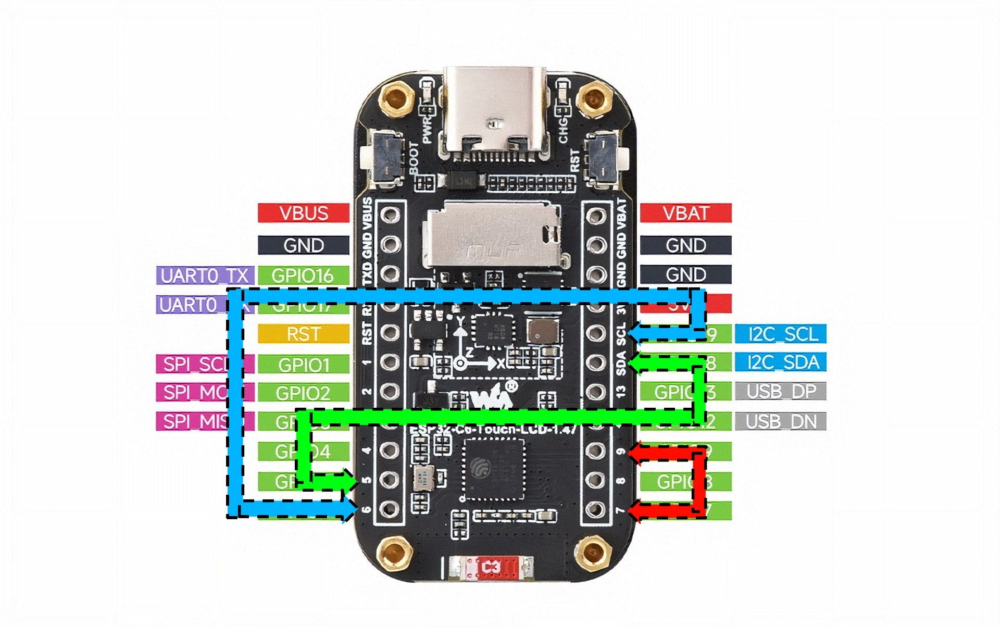

# Waveshare ESP32-C6-Touch-LCD-1.47 install guide

| | |
|---|---|
| MCU | ESP32-C6 single-core RISC-V, **no PSRAM**, 512 KB SRAM |
| Display | JD9853 LCD 172×320, SPI (narrow-screen UI layout), PWM backlight |
| Touch | AXS5106L capacitive (I²C) |
| RTC | **On-chip** no dedicated RTC chip on this board |
| IMU | QMI8658 (I²C) |
| Power | **No PMU** battery sensed over an ADC divider (ETA6098 charger) |
| Storage | microSD over SPI (shares the display bus) |

> **This is the single-core, PSRAM-less board.** Because it has no PSRAM, a few of
> the build steps below differ from the S3 boards. Notably, several library patches
> and the PSRAM setting do not apply. The differences are called out where they occur.

---

## 1. Install the Arduino IDE

Download and install the Arduino IDE from
<https://www.arduino.cc/en/software/>.

Launch it once so it creates your sketchbook (libraries) folder.

## 2. Install the ESP32 core (Espressif Systems)

Open the Board Manager in the Arduino IDE, search for `esp32`, and install it. Make
sure the version you install is the one provided by **Espressif Systems** not the
legacy "Arduino ESP32 Boards" entry.

## 3. Place the bundled libraries

Place the provided libraries from this repo into the Arduino IDE libraries directory.
The location varies depending on what OS you are running.

On Windows the default location for the libraries is:
`C:\Users\yourusername\Documents\Arduino\libraries`

On Linux the default location for the libraries is:
`~/Arduino/libraries`

Copy the **contents** of this repo's `libraries/` folder in, so the library folders
and `lv_conf.h` land directly inside it. `lv_conf.h` must sit **next to** the `lvgl`
folder, not inside it. If an older `lvgl` or `GFX_Library_for_Arduino` is already there, 
overwrite it; the firmware needs these exact versions (LVGL 9.5.0, Arduino_GFX 1.6.5).

## 4. Install the custom SoC libs

Replace the `esp32c6-libs` by first deleting the original directory then placing the
provided libs from this repo in the correct location. The location varies depending on
what OS you are running.

On Windows the location for the esp32 libs is:
`C:\Users\yourusername\AppData\Local\Arduino15\packages\esp32\tools`

On Linux the location for the esp32 libs is:
`~/.arduino15/packages/esp32/tools`

> The C6 needs `esp32c6-libs`. The `esp32s3-libs` set is only for the S3 boards, so
> you can leave it alone here.

## 5. Apply the library patches

The firmware relies on a few modifications to LVGL and the ESP32 core that live outside
the sketch. Run the apply script once. It dry-runs first and aborts without changing
anything if a patch would not apply cleanly (usually a version mismatch, install the
exact versions in steps 3–4), and it is safe to re-run.

On Windows (PowerShell needs `git` on PATH, which the toolchain provides):
```powershell
cd .\patches
./apply_patches.ps1
```

On Linux (bash needs `git`, e.g. `sudo apt install git`):
```bash
cd ./patches
./apply_patches.sh
```

> **Which patches matter on the C6.** This board has **no PSRAM**, so the PSRAM- and
> QSPI-related patches (the screen cache, the async-DMA QSPI flush, the PSRAM-size
> report) are not used, they simply have no effect here. The ones that do matter are
> the LVGL core-pin patch, the BLE toggle-crash fix, and the I²S speaker fix. You do
> not need to pick and choose, though: the apply script only touches what is present,
> and already-applied or irrelevant patches are skipped. Full per-patch table:
> [`patches/README.md`](../../patches/README.md).

After patching, clear the Arduino build cache so the patched libraries recompile:
- On Windows, delete the contents of `%LOCALAPPDATA%\arduino\sketches\`
- On Linux, delete the contents of `~/.cache/arduino/sketches/`

## 6. Select the board & partition table

**a) Board.** Open `OpenWatchFace/board.h` and set:

```c
#define BOARD_SELECT  BOARD_ID_C6_147
```

Everything else, pin map, drivers, feature flags, screen geometry follows from that
one line.

**b) Partition table.** Copy the C6's 8 MB table over `partitions.csv` in the
`OpenWatchFace/` folder.

On Windows (PowerShell):
```powershell
Copy-Item -Force ".\OpenWatchFace\partitions_c6_8mb.csv" ".\OpenWatchFace\partitions.csv"
```

On Linux (bash):
```bash
cp -f ./OpenWatchFace/partitions_c6_8mb.csv ./OpenWatchFace/partitions.csv
```

> `board.h` **and** the partition file must match. The custom partition is required:
> `app0` must stay pinned at `0x10000` or the watch boots to a black screen.

## 7. Board settings

There is no dedicated Waveshare entry for this board, use the generic
**ESP32C6 Dev Module**:

| Setting | Value |
|---|---|
| Board | **ESP32C6 Dev Module** |
| Erase All Flash Before Sketch Upload | **Enabled** (first flash only) |
| Flash Size | **8MB** |
| Partition Scheme | **Custom** (uses `partitions.csv`) |

> Leave the other ESP32C6 Dev Module options at their defaults. The C6 is single-core
> with no PSRAM, so (unlike the S3 boards) there are no Core or PSRAM settings to set.

## 8. Build & flash

Open `OpenWatchFace/OpenWatchFace.ino`, then **Verify** (compile) and **Upload**.

- **Upload trouble?** Hold **BOOT**, tap **RST**, release **BOOT** to enter download
  mode, then upload again.
- **First-time clock set:** connect to a WiFi network to sync the clock automatically,
  or set `FORCE_TIME_SET` to 1 with your current time and flash once. (This board keeps
  time on the C6's on-chip RTC, it does not survive a full power loss the way the
  PCF85063 boards do, so WiFi/BLE time sync matters more here.)
- **microSD recommended:** format a card FAT32 (This does not work in Windows and will
  fail if you use Windows own formatting tools) and insert it for notification history,
  WiFi credentials, and battery-health logging. Without one the watch falls back to
  on-flash storage.

---

## Optional settings you can tune

All of these are compile-time and live in the sketch folder.

### Board header `OpenWatchFace/board_ws_c6_touch_lcd_147.h`

| Setting | Default | What it does |
|---|---|---|
| `BOARD_PARTIAL_BUF_LINES` | `43` | Lines per LVGL render buffer (×2). Each buffer costs `172 × lines × 2` bytes of SRAM keep it modest, there is no PSRAM to fall back on. Fixed at compile time; never auto-size it. |
| `BOARD_LCD_BUS_HZ` | `80000000` | Display SPI clock. Drop it if you ever see tearing or garbage. |
| `BOARD_PWR_CPU_K` | `0.00130` | Awake power model, CPU term. An **estimate** (single core ≈ half the S3's); refine against a meter this board's ADC battery header lets you measure. |
| `BOARD_PWR_IMU_MW` | `2.0` | IMU draw added when the step counter / sleep tracker runs. |
| `BOARD_HAS_LP_STEPS` | `1` | Deep-sleep step counting on the C6 LP core **requires hardware mod 2 below**. |
| `BOARD_WAKE_GPIO` | `7` | Deep-sleep wake input **requires hardware mod 1 below** (BOOT bridged to GPIO7). |

### Extra

| Setting | File | Notes |
|---|---|---|
| `OVERCLOCK_ENABLE` | `overclock.h` | Past 160 MHz on the C6. **Can hang or scramble flash/NVS** read the header's recovery notes first. |
| `UNDERVOLT_ENABLE` | `settings_store.h` | Core-rail undervolt. **Disabled by default** the shipped table is all-stock, so it is a no-op until you opt in and edit it. Validate each step against a meter before trusting it; see the [overclocking & undervolting](../../README.md#experimental-overclocking--undervolting) section. |
| `CORE_UV_MV[]` | `core_voltage.h` | Real core (dig_dbias) undervolt, separate from the rail one above. Default 1150 mV = stock. Also off unless you edit it. |
| `BATT_DESIGN_MAH` | `power_model.h` | 400 is the default battery design capacity set in for the device (mAh). Change this to fit your battery size and get better battery health data. |

> The AXP2101 rail undervolt does **not** apply here, there is no PMU rail to trim, so
> that path is a no-op on the C6.

---

## Device-specific notes

- **No PSRAM, single core.** The screen cache and other PSRAM-only paths compile out,
  and rendering runs on the one core. This is the most memory-constrained target.
- **No RTC chip.** Timekeeping uses the C6's on-chip RTC, so time is not battery-backed
  the way it is on the PCF85063 boards, rely on WiFi/BLE sync after a power loss.
- **Shared SPI bus.** The microSD card sits on the **same SPI bus as the display**
  (MISO 3 / MOSI 2 / CLK 1, CS 4). The firmware arbitrates the two per-transaction; you
  do not need to do anything, but it is why the display bus is constructed with a MISO
  pin even though the panel itself is write-only.
- **PWM backlight.** Brightness is a PWM duty on `LCD_BL` (GPIO23), not a panel command
  like the AMOLED boards.

---

### Two optional hardware mods

Two features on the **ESP32-C6-Touch-LCD-1.47** depend
on the C6's low-power silicon and need a single bridging wire each. Both are optional and
non-destructive (no trace cuts) solder them only if you want the feature. The colored
wires below match the photo.



**1. Waking from deep sleep with BOOT, the red wire (GPIO9 → GPIO7)**

On the C6 the BOOT button sits on **GPIO9**, but the C6's deep-sleep wake silicon only
accepts **GPIO0–7** (GPIO9 is a strapping pin and is outside the wake mask, confirmed by
a failed library rebuild; it can't be overridden in software). So out of the box a BOOT
press *cannot* wake the C6 from deep sleep; you'd have to use the **RST** button, which is
a full reset that wipes the sleep-retained step count.

The fix is the **red** wire, bridging the BOOT node (**GPIO9**) to **GPIO7**, which *is*
in the wake mask and is not a strapping pin. (GPIO7 was the PWM speaker pin; the speaker is
removed on this board, so the pin is free.) One BOOT press now pulls both GPIO9 (the awake
menu, unchanged) and GPIO7 (the deep-sleep wake) low. The firmware arms a wake-on-low on
GPIO7 automatically when this board is selected no config change needed.

**2. Counting steps during deep sleep, the green and blue wires (IMU → GPIO5/6)**

While awake, the firmware counts steps fine on either board. During **deep sleep** the
main CPU is off, so the count has to come from the coprocessor: the S3's RISC-V ULP, and
on the C6 its **LP (low-power) core**. The catch is that the LP core can only drive GPIOs
in the LP power domain **GPIO0–7** but the IMU's I²C bus is wired to **GPIO18 (SDA)**
and **GPIO19 (SCL)**, which the LP core can't reach. So without a mod the C6 simply stops
counting the moment it sleeps.

The fix is to bridge the IMU's I²C lines into the LP domain:

- **green** wire: **GPIO18 (IMU SDA) → GPIO5**
- **blue** wire: **GPIO19 (IMU SCL) → GPIO6**

This makes each pair a single shared net, so the IMU is reachable from either pin. While
awake the IMU stays on the normal touch bus (GPIO18/19) exactly as stock; while asleep the
LP core bit-bangs I²C on GPIO5/6 (GPIO18/19 are powered down with the main domain, so there
is no contention). With these two wires in place the C6 keeps counting steps through deep
sleep and folds them into the total on the next wake.

> **Contention rule** (already handled by the firmware): GPIO5≡GPIO18 and GPIO6≡GPIO19 are
> the *same* nets, never drive both pins of a pair at once. The firmware only ever drives
> GPIO5/6 while asleep and GPIO18/19 while awake, so the two never collide.
