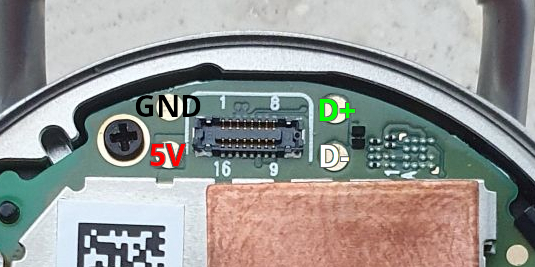

# Fossil Gen 4 (firefish / ray) install guide

| | |
|---|---|
| SoC | Qualcomm **APQ8009W** (Snapdragon Wear 2100) quad Cortex-A7, run bare-metal in AArch32. Cores 0 and 1 run the firmware (core 1 renders frame pushes, a big win on this 454×454 panel); cores 2 and 3 stay off. Deep sleep = full cluster power collapse + RPM XO shutdown, ~6 mA measured |
| Display | 454×454 AUO AMOLED, MSM DSI **command mode** (MDP3 DMA_P pipe takeover) |
| Touch | Raydium RM_TS (I²C, BLSP1 QUP5 @ `0x39`) |
| Crown | **PixArt PAT9126 optical rotation sensor** (I²C @ `0x75`) scroll + quick-shade |
| RTC | PM8916 PMIC RTC (battery-backed, read over SPMI) |
| IMU | QMI8658 **not detected on this unit**, step counting disabled |
| Power | PM8916 PMIC over SPMI (fuel gauge, charger, button, vibrator) |
| Storage | **Ported from the Gen 6 (2026-08-30), untested on this watch.** eMMC via sdhci-msm, NVS (Preferences) + FFat + log file inside the `userdata` partition. First boot creates the superblock and formats a FAT32 volume there — Wear OS `/data` is overwritten from then on |
| Toolchain | **Bare-metal + FreeRTOS** no Arduino IDE |
| Status | **Working** display, touch, crown, vibration, USB log console |

> **This is not an Arduino build.** There is no IDE, no board package and no
> Upload button. The firmware is a bare-metal ARM image with its own FreeRTOS
> runtime, compiled by a shell script and flashed with `fastboot` as an Android
> boot image. If you have only ever flashed the ESP32 boards, nothing on this
> page carries over except the LVGL libraries.

> ## ⚠️ Read this before you buy tools: the Gen 4 has no USB connector
>
> The charger's pogo pads carry USB D+/D−, but unlike the Gen 6 they are **not
> exposed in a way a stock charger can use.** Getting a data link to this watch
> means soldering four wires to the main board; the pads and colours are shown
> under [How to wire USB to the Gen 4](#1-connect-the-watch-how-to-wire-usb-to-the-gen-4). Without that link there is no `fastboot`, no
> `adb`, and therefore no way to install anything.
>
> This is the single biggest practical difference from the Gen 6, and it is
> worth settling before you go any further.

> **You do not have to overwrite Wear OS.** Unlike the Gen 6, **`fastboot boot`
> works on this watch** it loads the firmware into RAM and runs it, writing
> nothing. A power cycle returns you to stock. See
> [RAM boot](#option-a-ram-boot-recommended-nothing-is-written).

---

## Before you start

The recovery ladder does not depend on the firmware being sane:

- **Reboot to fastboot** the way in, described under [Enter fastboot](#2-enter-fastboot).
- **Hold the power button** the watch switches off.
- **EDL (9008) + QFIL** the last-resort unbrick, never needed so far.

Because the normal test cycle is a RAM boot that writes nothing, a bad image on
this watch costs you a power cycle rather than a recovery operation.

> **Never flash `aboot`, `sbl1`, `tz` or `rpm`.** Only `boot` is ours.

---

## Host tools you need

**Android SDK platform-tools** the package that provides `adb` and `fastboot`.

### Linux

```sh
sudo apt install android-sdk-platform-tools fastboot     # Debian / Ubuntu
```

If your distribution does not package it, download the **SDK Platform-Tools for
Linux** zip from <https://developer.android.com/tools/releases/platform-tools>,
extract it, and run the commands on this page from inside that folder.

> **Arch-based distributions:** install the AUR package
> **`android-sdk-platform-tools`**, *not* the repo package `android-tools`.
> They are different packages; the AUR one ships Google's official prebuilt
> binaries, which is what these instructions assume.
>
> ```sh
> yay -Sy android-sdk-platform-tools
> ```

### Windows

Use **WSL (Debian/Ubuntu)** and follow the Linux instructions. Building the
image yourself requires a Linux environment in any case. You will also need
`usbipd` to pass the watch's USB connection through to WSL the
[Gen 6 page](fossil-gen6.md#2-enter-fastboot) walks through that step by step,
and it is identical here.

### Check it works

```sh
adb version
fastboot --version
```

---

## Part 1: Getting an image

### Option A: download a prebuilt image (recommended)

Grab the Fossil Gen 4 `.img` from the [GitHub releases page](../../../../releases)
and skip to [Part 2: Flashing](#part-2-flashing).

### Option B: build it yourself

#### Prerequisites

| Thing | Where / how |
|---|---|
| ARM toolchain | `arm-none-eabi-gcc` on your `PATH` (Arm GNU 14.2.Rel1 in use) |
| Python3 | used by the image packer |
| LVGL | this repo's `libraries/lvgl` (auto-detected), or `~/Arduino/libraries/lvgl` |
| DTB | `snapdragon-port/firefish-stock.dtb` **in this repo, nothing to dump** |

#### Build

Two commands, and the second one's DTB argument is **not** optional:

```sh
cd snapdragon-port/baremetal

# 1. compile + link
CFLAGS_EXTRA="-DWDOG_TRACE -DSLEEP_NO_WDOG -DSYS_PC_8909 -DSYS_PC_STAGE=6 -DL2_SAW_AP_ENABLE -DSYS_PC_XO_SHUTDOWN -DMSS_BOOT -DMSS_PROXY_VOTES -DSLEEP_RAILS_OFF=0x1B40" sh build-owf-image-gen4.sh

# 2. pack into an Android boot image, WITH the stock DTB appended
sh tools/mk-bootimg.sh build/gen4-owf/owf.bin ../dtbs/firefish-stock.dtb

ls build/gen4/       # result: build/gen4/owf-boot.img
```

> ### The DTB argument is not optional
>
> aboot on msm8909 picks a device tree by board-id from a DTB **appended to the
> kernel** (the `zImage-dtb` convention). Without one it rejects the image with
> *"dtb not found"* a safe, non-destructive refusal, but it means
> `mk-bootimg.sh` called without its second argument silently produces an image
> that cannot boot. `firefish-stock.dtb` is this watch's own dumped tree and
> rides along behind the payload, which self-relocates, so it disturbs nothing.

> **`-DWDOG_TRACE` is load-bearing.** aboot hands over with the APPS watchdog
> armed at an 11 s bark, and this flag is the only thing that compiles
> `wdog_pet()` into the main loop. Without it the watch warm-resets into Wear OS
> a few seconds into every boot which looks exactly like "the image never ran".

> **The flag set above is the release set.** `-DWDOG_TRACE` alone still boots
> and runs, but sleeps at ~45 mA with the core merely clock-gated; the five
> sleep flags are what turn that into the ~6 mA cluster collapse, and the two
> `MSS_*` flags load the modem. They are explained one by one under
> [Build flags](#build-flags).

#### Publishing an image: strip your MAC first

The Gen 4 build embeds `firmware/gen4/wcnss_nv.c` when you have one, and
`tools/mk-wcnss-nv.sh` bakes **your** watch's MAC into `wcnss_mac[]` — which is
then compiled into the `.img`. Publish that build and every watch that flashes
it transmits your address: your device identifier turns up on strangers'
networks, and two of them on one network fight over ARP and DHCP.

Build release images with `OWF_PUBLIC=1`:

```sh
OWF_PUBLIC=1 CFLAGS_EXTRA="..." sh build-owf-image-gen4.sh
```

That removes the `wcnss_mac` symbol from the object entirely — not merely
ignoring it at runtime, which would leave the bytes in the binary for anyone to
extract — and `wlan_mac()` derives a **locally-administered** MAC per device
from the eMMC CID instead: unique to each watch, stable across reboots, nothing
to do with whoever built the image. The boot log says which it used:

```
wlan: MAC 02:xx:xx:xx:xx:xx (derived per device from the eMMC CID)
```

The NV table itself stays in the image. It is board calibration data, contains
no MAC (that lives in `/persist/wifimac.ini`), and is near-identical between
units — the C2, C2+ and S2 blobs are byte-for-byte the same 31723 bytes, and the
Gen 4's differs from them in 26 bytes of TX power table. Whether you may
redistribute the vendor's NV table at all is a licensing question, the same one
that applies to the `wcnss.mdt` radio firmware.

BLE needs nothing: its address is a random static one generated on first boot
and kept in NVS, so it is already per device.

Full build reference: [`snapdragon-port/BUILD-GEN4.md`](../../snapdragon-port/BUILD-GEN4.md).

---

## Part 2: Flashing

### 1. Connect the watch: how to wire USB to the Gen 4

The Gen 4 has no USB connector. The four pads next to the display connector on
the back of the main board are the USB link, and they are where this port's
cable is soldered:

<p align="center">
  
</p>

| Pad | Wire |
|---|---|
| 5V | red |
| GND | black |
| D+ | green |
| D− | white |

The two pads left of the connector are power (GND above, 5V below), the two
to its right are data (D+ above, D− below). Take the back cover off, solder the
four leads, route the cable out past the case edge and close the watch loosely
around it. If the watch does not enumerate, clean the joints with isopropyl
alcohol and recheck D+/D−.

> Standard USB colours are used throughout: **red = 5 V (VBUS)**, **black = GND**,
> **white = D−**, **green = D+**. A plain USB 2.0 cable with the device end cut
> off is all it takes; keep the D+/D− leads short and twisted. The pads are
> small: a fine tip, thin solder and flux, and check every joint for bridges
> with a multimeter before plugging in. Swapped D+/D− shows as the watch never
> enumerating; swapped power will destroy the watch.

### 2. Enter fastboot

From Wear OS with USB debugging enabled:

```sh
adb reboot bootloader
fastboot devices        # should list the watch
```

### 3. Unlock the bootloader

Required once, before you can flash **or RAM-boot** anything.

```sh
fastboot oem unlock
```

**This wipes user data**, which is expected. Confirm on the watch if it prompts.

> **Do not re-lock the bootloader afterwards.** A locked bootloader may refuse
> to boot an unsigned image, and you lose the ability to flash a fix. There is
> no benefit for this use case. I take no responsibility if you brick your
> hardware or lose data.

### 4. Back up your original installation

Wear OS is **not rooted**, so `adb shell` cannot read the raw block devices and
`dd` on a partition fails there is no way around that from inside Wear OS.
The way through is to borrow a kernel that gives you a **root adb shell**:
[AsteroidOS](https://asteroidos.org/) publishes a `boot.img` for the Gen 4
(**firefish**) at <https://release.asteroidos.org/>.

You may need to follow the guide on AsteroidOS website and install the full
rootfs in order to make this work. Because `fastboot boot` works on this watch, 
you can get a rooted shell **without flashing anything at all**:

```sh
fastboot boot asteroid-firefish-boot.img
adb shell id                 # should report uid=0(root)
adb shell ls -l /dev/block/bootdevice/by-name/
```

Then dump what you care about:

```sh
mkdir -p firefish-stock-backup && cd firefish-stock-backup
adb shell "dd if=/dev/block/bootdevice/by-name/boot" > boot.img
adb shell "dd if=/dev/block/bootdevice/by-name/recovery" > recovery.img
adb shell "dd if=/dev/block/bootdevice/by-name/persist" > persist.img
```

> **`persist` is the one that is genuinely irreplaceable** it holds
> per-device calibration data. `system` and `vendor` are large and can be
> re-obtained from a stock firmware package.

Check the results are real (`ls -l *.img` none should be 0 bytes) before
trusting them. Restore later with `fastboot flash boot boot.img`.

### 5. Run it

#### Option A: RAM boot (recommended, nothing is written)

```sh
fastboot boot owf-fossil-gen4.img
```

The firmware runs immediately. **Nothing is written to any partition** and a
power cycle returns the watch to stock, Wear OS untouched. This is the normal
way to use this port, and it is why Gen 4 development iterates faster than the
Gen 6.

#### Option B: permanent install (`boot` partition)

Only when you want the firmware to survive a reboot. **This replaces Wear OS.**

```sh
fastboot flash boot owf-fossil-gen4.img
fastboot reboot
```

---

## Using it

### Reading the log over USB

Once the firmware is running, **the USB connection becomes a serial console**
a CDC-ACM device that streams the firmware log. It is not `adb`.

```sh
cat /dev/ttyACM0
```

The whole ring buffer is replayed when you connect, so you get everything
printed since boot even if you plugged in late.

> The watch has **no exposed UART pad**, and `uart_init()` is deliberately
> disabled (`PLAT_UART_DISABLED`) reading a clock-gated MSM block hangs the
> AHB transaction and killed the very first image that ran. The USB console is
> the log.

### The crown

The rotating crown is an **optical motion sensor**, not a quadrature encoder,
and it drives:

- **On the watchface** roll down to pull down the quick-shade.
- **In the shade** roll up to close it.
- **In any app or list** roll to scroll.

Feel is tuned by two knobs in
[`OpenWatchFace/board_fossil_gen4.h`](../../OpenWatchFace/board_fossil_gen4.h):
`CROWN_SCROLL_PX_PER_CNT` (pixels of scroll per sensor count) and
`CROWN_SHADE_OPEN_CNT` (how much of a roll opens the shade). The driver-side
facts axis and I²C address live in
[`snapdragon-port/baremetal/boards/fossil_gen4.h`](../../snapdragon-port/baremetal/boards/fossil_gen4.h).

### First run

- **Set the clock** manually, or from WiFi once that exists.
- **Storage leaves Wear OS alone.** Since v87 the firmware checks `userdata`
  before claiming it. If it still holds a Wear OS volume (ext4, f2fs, or an
  encrypted volume with its crypto footer), storage stays **read-only for that
  boot**: settings live in RAM only, nothing is written, and the log says
  `storage: userdata holds ... (Wear OS) - NOT touching it`. That is what you
  want for a RAM boot. For a real install, erase the partition once and the
  next boot creates the firmware's own volume:

  ```sh
  fastboot erase userdata
  ```
- **Settings persist** once `userdata` has been erased: NVS for Preferences,
  an FFat volume and `/owf-log.txt`, all inside `userdata`. The ramlog line
  `storage: userdata @...` (USB console) or the Files app is the check.
- **Deep sleep is the real thing since v199.** Pressing nothing for two
  minutes (or a double tap on the pusher) collapses the whole CPU cluster through
  the SoC's SAW sequence and TrustZone, the RPM applies the sleep set and enters
  XO shutdown, and the watch wakes on the button or the PMIC RTC alarm. Measured
  on the C2 with the STC3117 coulomb counter: **about 6 mA average** asleep
  (4.20 V to 4.16 V over a three-hour sleep), the same range as stock Wear OS
  idling with its screen off. The wake log prints
  `rpm-masters[post-resume] APSS shutdowns=N xo=N` as proof the RPM took part
  and, on the C2/S2, `sleep-gauge: soc a -> b over N s = avg X mA`. USB
  re-enumerates after a wake; the display comes back on the button.
- **HTTPS works (mbedTLS, SoC hardware RNG).** Weather and NTP use plain
  HTTP/UDP; the over-the-air update path is HTTPS to GitHub and is confirmed
  end to end since 1.5.0: check, download with resume, SHA-256 verify, write
  to `boot`, reboot.

---

## Build flags

Only relevant if you are building yourself. Everything is **silent by default**;
failures always print.

### Recommended (what the release images are built with)

```
CFLAGS_EXTRA="-DWDOG_TRACE -DSLEEP_NO_WDOG -DSYS_PC_8909 -DSYS_PC_STAGE=6 -DL2_SAW_AP_ENABLE -DSYS_PC_XO_SHUTDOWN -DMSS_BOOT -DMSS_PROXY_VOTES -DSLEEP_RAILS_OFF=0x1B40"
```

| Flag | What it does |
|---|---|
| `-DWDOG_TRACE` | Pets the APPS watchdog from the main loop. **Load-bearing**: without it the watch warm-resets a few seconds into every boot. |
| `-DSLEEP_NO_WDOG` | Deep sleep is one uninterrupted collapse until the button or the RTC alarm, with the watchdog stopped for its duration. Without it the sleep is chopped into 15 s chunks to pet the dog, each one a full wake. |
| `-DSYS_PC_8909` | The **system power collapse**: L2/cluster off through the SAW sequence, TrustZone warm boot, RPM sleep set. This is the whole difference between ~45 mA and ~6 mA asleep. |
| `-DSYS_PC_STAGE=6` | The cluster level to use: 6 = the kernel's `l2-pc` (RPM handshake, sleep set applied). 7 = `l2-gdhs` (cluster off, no RPM handshake, ~37 mA) is the fallback if 6 ever misbehaves on a unit. |
| `-DL2_SAW_AP_ENABLE` | Leaves the L2 SAW in its retention mode while awake, as the shipped kernel does between sleeps. Saves a few mA of awake-idle current. |
| `-DSYS_PC_XO_SHUTDOWN` | Drops the crystal vote from the sleep set so the RPM can enter XO shutdown / Vdd-min. Measured on the C2: 37 mA without it, **about 6 mA** with it. |
| `-DMSS_BOOT` | Loads and authenticates the modem image from the `modem` partition behind the loading screen, and runs the host services it needs (rmtfs, RFSA, memshare, sensor registry). The modem loads before WiFi and the rest of the app. |
| `-DMSS_PROXY_VOTES` | Holds the modem's CX/MX and bus votes through the RPM during the load and releases them afterwards. Without the release the RPM keeps those rails and bus clocks up through every collapse, which costs ~15 mA asleep. |
| `-DSLEEP_RAILS_OFF=0x1B40` | Switches PMIC rails `l6`, `l8`, `l9`, `l11` and `l12` off for every deep sleep and back on first thing at wake (tested on the Gen 4, 2026-09-22). See [Switching individual rails off](#switching-individual-rails-off--dsleep_rails_off). |

**`MSS_OPEN_MASK` is not passed on this watch** — `boards/fossil_gen4.h`
defaults it to `0x6D` and you should leave it alone. It selects which SMD
channels are opened towards the modem, and the two bits it clears out of the
`0x7F` default are the expensive ones: bit 1 starts the fastrpc listener and
bit 4 (`DIAG_CNTL`) compiles in `mss_diag.c`, which answers the modem's SSID
range report by enabling **every** F3 debug level on every range and then
receives the resulting message stream for as long as the watch runs. That
machinery exists for the Wear 3100 modem stall and diagnoses nothing here; it
was linked into Wear 2100 images by accident in v473 and cost real current
until v484. `0x6D` opens the same channels as before and asks the modem for
nothing.

**WiFi RX polling is on by default** — `boards/fossil_gen4.h` defines
`PLAT_WCNSS_RX_DESC_POLL`, so it is not in the flag set above. Some Gen 4 units
never raise the DXE interrupt bit the receive path used to wait for: the radio
comes up (`wlan: radio UP`), Bluetooth pairs, but every scan prints
`wcn36xx: scan ch 1..13: RX frames 0, beacons 0, networks 0`. Frames *are*
delivered into memory; they were just never collected. With the flag the driver
checks the receive descriptors directly, and the scan line ends with
`rx head resyncs N`. Found on unit `C0F8413D3327` (2026-09-19), whose firmware
and NV are byte-identical to a Gen 4 that scanned without it; the Gen 5 has
needed the same flag since 2026-09-10. It costs nothing on units that do raise
the bit, so leave it on. If you see `RX frames 0` on an image built before
this, rebuild — or pass `-DPLAT_WCNSS_RX_DESC_POLL=1` in `CFLAGS_EXTRA`.

Since v199 all three Wear 2100 watches run **dual core** by default (core 1
renders and idles in WFI; it is handed to TrustZone with the hotplug flag
before every collapse). `-DNO_SMP_CPU1` builds the single-core variant.

### Load-bearing

| Flag | What happens without it |
|---|---|
| `-DWDOG_TRACE` | Nothing pets the APPS watchdog and **the watch warm-resets into Wear OS a few seconds into every boot.** Also enables the `wdog_stage()` staircase, which is this watch's only debugger when there is no display. |

### Do **not** pass

| Flag | Why not |
|---|---|
| `-DDISPLAY_BISECT` | Its stage table maps stages 2–8 to "already proven, leave the watchdog alone" proven on the **Gen 6**. On the Gen 4 it silently disables exactly the part of the staircase you would need. |
| `-DTSENS_ENABLE` | The die-temperature block is opt-in because enabling it **hard-crashes the Power app** on this SoC (found on the C2, same APQ8009W). |
| `-DWCNSS_CORNER_VOTES` | The RPM "corner" votes reset the SoC on the PM8916 (found on the C2). The radio comes up fine without them. |
| `-DSLEEP_BATT_DIAG` | Suspends the C2/S2's SMB231 charger. The Gen 4 has no SMB231, so it does nothing here. |

### Experimental / measurement flags

None of these are in the release images. They exist for bring-up and for
measuring the sleep floor.

| Flag | Effect |
|---|---|
| `-DNO_SMP_CPU1` | Single core: core 1 is never booted. Frame pushes run synchronously. Slower UI, no power difference asleep. |
| `-DSYS_PC_STAGE=7` | The `l2-gdhs` cluster level instead of `l2-pc`: no RPM handshake, ~37 mA asleep. Fallback only. |
| `-DSYS_PC_XO_PARK` | Parks the CPU clock on the 19.2 MHz crystal before the collapse instead of staying at 400 MHz on GPLL0. The kernel stays at its 400 MHz safe rate; this was the old behaviour and it made TrustZone's wake time out. Keep off. |
| `-DSLEEP_FLOOR` | The RPM active-set "ladder" (DDR/PLL/LDO/CX votes measured one by one on a cable). Costs ~50 s awake before every collapse and every one of its steps measured 0 mA, so it stays off. `-DSLEEP_FLOOR_SKIP=<mask>` skips steps. |
| `-DSPM_NO_PMIC_DATA` | Skips programming the L2 SAW's PMIC_DATA words. The kernel writes them; the bootloader leaves them at zero and the pc/gdhs sequences then send zeros to the rail controller and the wake never returns. Bisect flag only. |
| `-DSPM_NO_L2_VDD_INIT` | Skips the SAW voltage-control init (VCTL / PMIC_DATA_3 = the CPU rail's VSET). Same warning: this is what stock's spm-regulator does at probe and the wake needs it. |
| `-DSMP_PARK_CPU23` | Tries to boot cores 2 and 3 into TrustZone power collapse. Resets the C2 on release. Do not pass. |
| `-DTZ_RPM_IRQS_FORCE` | Force-enables TrustZone's two RPM interrupts in the GIC. Stock TZ never uses them during cluster sleep; no effect. |
| `-DSYS_PC_WARM_RESET_DIAG` | Makes a PS_HOLD drop a WARM PMIC reset so DDR/IMEM breadcrumbs survive. The setting persists in the PMIC and **breaks USB enumeration on every later boot** until restored. Do not pass. |
| `-DSLEEP_PAS_KILL_RADIO` | The old sleep path that shut Pronto down through PAS before sleeping. It leaves a ghost RPM master holding the 3.3 V PA rail; the radio now idles resident instead. Do not pass. |
| `-DPC_TRACE` | One flash write per power-collapse breadcrumb during the first attempts of a boot. Bring-up only. |
| `-DUSB_LOG_V2` / `-DUSB_IRQ_WAKE` | The reworked USB console (tail-first replay, host commands) and USB-as-wake-source. Both broke the live log when tried; off. |
| `-DSLEEP_FLOOR_STEP_MS=<ms>` | How long each `-DSLEEP_FLOOR` step is held and measured. Default `6000`. |
| `-DSLEEP_RAILS_OFF=<mask>` | PMIC rails switched off for each deep sleep and back on at wake (bit N = `lN`, bit 24+N = `sN`). The recommended line passes `0x1B40`; the board header's own default is still `0` (every rail on). See below. |
| `-DNO_AUTO_REBOOT` | Disarms the APPS watchdog completely (only when `-DWDOG_TRACE` is **not** passed). For bench sessions where nothing should reset the watch; a hang then needs a forced power-off. |

#### Switching individual rails off: `-DSLEEP_RAILS_OFF`

The recommended mask `0x1B40` cuts these rails for every deep sleep (all tested on a
Gen 4 on 2026-09-22: the watch wakes normally, the display, touch, storage and the
step counter all come back):

| Rail | Bit | Mask | What it feeds on the Gen 4 (firefish DT) | What the wake path does |
|---|---|---|---|---|
| `l6`  | 6  | `0x40`   | Panel controller I/O (`vddio`) **and the LSM6DS3 IMU** | Panel reset pulse + the AUO h139 on-command table. **Kept on while the pedometer or a sleep session is running**, so steps keep counting through the sleep; cut otherwise. |
| `l8`  | 8  | `0x100`  | eMMC supply (2.85 V) | The card is sent to sleep before the cut and fully re-initialised at wake (`emmc: FULL re-init OK`). The log file catches up from the RAM ring. |
| `l9`  | 9  | `0x200`  | WiFi power amplifier | Nothing needed; stock has it off with WiFi off. |
| `l11` | 11 | `0x800`  | Debug trace blocks + a disabled SD slot | Nothing needed. |
| `l12` | 12 | `0x1000` | Same blocks, I/O side | Nothing needed. |

Before the cut the panel reset line is driven low, so no current leaks into the unpowered
panel through its reset pin (with it held high the sleep drew **more** than without any cuts).
Rails not in the mask: `l18` (panel supply, also the crown sensor: not tried), `l14`/`l16`
(crown sensor, touch I2C), `l15` (NFC chip). The restore voltage of every cut rail is read
from the PMIC at sleep entry, so the C2's table values are never applied to this watch.
`-DSLEEP_RAILS_OFF=0` keeps every rail on.

The remaining sleep draw with this mask is low single-digit mA (one 2 h sleep from a settled
4.05 V showed no visible drop on the display); a longer measured run is still to be done.

### Tunables

Values with a default in the source; override with `-DNAME=<value>`.

| Flag | Default | What it sets |
|---|---|---|
| `-DMSS_OPEN_MASK=<mask>` | `0x6D` (board header) | SMD channels opened to the modem; leave alone (see above) |
| `-DFB_IDLE_MS=<ms>` | `500` | Idle frame refresh interval that keeps the display controller fed |
| `-DUSB_LOG_TAIL=<bytes>` | `16384` | How much recent log a fresh USB console connection replays |
| `-DUSB_IN_STUCK_MS=<ms>` | `5000` | After this long a stuck USB log transfer is flushed and re-sent |

`-DUSE_SYS_SUSPEND` and `-DUSE_CPU_PC` have **no effect** on this build: the
build script always passes `-DUSE_CPU_PC_8909`, which takes precedence.

### Diagnostics

The release images carry no diagnostic flag; the log then carries errors,
failures and one-line milestones only (plus the sleep entry/exit census).

| Flag | Brings back |
|---|---|
| `-DLOG_VERBOSE` | the step-by-step narration: WCNSS bring-up, SMEM/SCM probing, the WPA2 handshake, scan results, the 10 s load census, SMP and power-collapse dumps, each suspend cycle, BLE traces |
| `-DBOOT_DIAG` | MDSS clock bring-up, the DMA_P splash probe, framebuffer geometry, TLMM mux, touch probe |
| `-DSMEM_DIAG` | the SMEM table and RPM ping, the first things to read when the radio does not start |
| `-DWIFI_DIAG` | every WCNSS bring-up step (PAS, SMD channels, NV download, HAL start) |
| `-DBT_TRACE` | HCI-level tracing of the NimBLE transport |
| `-DBT_DIAG` | a raw HCI reset / advertise test **instead of** the NimBLE host, never together with a build you want BLE from |
| `-DSLEEP_DIAG` | the suspend/resume path and wake sources |
| `-DCROWN_DIAG` | crown probe, an I²C bus scan, a PAT9126 register dump, and a 2 s heartbeat with live X/Y deltas use when the crown does nothing |
| `-DUSB_DIAG` | the 5 s USB heartbeat (`portsc`, `ccs`, `spd`, …) use when enumeration itself is broken |
| `-DTOUCH_DIAG` | paints a diagnostic colour **only if** the touch probe fails; inert when touch works |
| `-DFB_COLORTEST` | a four-band R/G/B/W test pattern held for 5 s before LVGL starts; names the pack order and stride outright |
| `-DLV_DIAG` | the per-10 s LVGL render / touch census |
| `-DPLAT_STORAGE_NOWRITE` | read-only storage: nothing is formatted or written to `userdata` |

> **Never add an unconditional print to a per-frame path.** It wraps the 64 KB
> ramlog faster than the 1 Hz flush can drain it, and the log becomes one line
> repeated forever.

### What the script sets for you

`CFLAGS_EXTRA` is *added to* a fixed set that `build-owf-image-gen4.sh` puts on every compile
line. You never pass these and you cannot omit them:

| Define | What it selects |
|---|---|
| `-DPLAT_BOARD_FOSSIL_GEN4` | Pulls in `baremetal/boards/fossil_gen4.h`: the PMIC blocks, panel, touch, rails and board defaults such as `MSS_OPEN_MASK`. |
| `-DBOARD_SELECT=BOARD_ID_FOSSIL_GEN4` | Picks `OpenWatchFace/board_fossil_gen4.h` on the app side. The app never sees the `PLAT_` headers, so the board is named twice. |
| `-DUSE_CPU_PC_8909` | Compiles the CPU power-collapse entry points. |
| `-DLV_CONF_INCLUDE_SIMPLE` | LVGL takes its config from this repo's `lv_conf.h`. |
| `-DOWF_APP` | `main.c` builds the real app entry instead of `ui_demo.c`. |

### Environment variables

| Variable | Default | Effect |
|---|---|---|
| `OWF_PUBLIC` | unset (`0`) | `1` strips `wcnss_mac` from the NV object; see [Publishing](#publishing-an-image-strip-your-mac-first). Use it for anything you hand to someone else. |
| `CFLAGS_EXTRA` | empty | The flag set above. **Empty means a watch that warm-resets every few seconds**: `-DWDOG_TRACE` lives here, not in the script. |
| `OWF_GEN4_FW` | `../firmware/gen4`, else the first `../firmware/gen4-*` with a `wcnss_nv.c` | Which watch's NV blob to compile in. The build prints the directory it picked (`[owf] NV blob from ...`). |
| `LVGL_DIR` | this repo's `libraries/lvgl`, else `~/Arduino/libraries/lvgl` | Where LVGL comes from. |
| `CROSS` | `arm-none-eabi-` | Toolchain prefix. |

> **LVGL is cached per build directory.** `liblvgl-owf.a` is built once and
> reused; changing `LVGL_DIR` or an LVGL config afterwards has no effect until
> you delete it.

---

## Troubleshooting

| Symptom | Cause / fix |
|---|---|
| `fastboot devices` shows nothing | The USB link. This watch has no USB connector see the warning at the top. Then clean the pads with isopropyl alcohol and re-seat. |
| `fastboot boot` fails with *dtb not found* | You packed without the DTB argument. Re-run `mk-bootimg.sh` with `../dtbs/firefish-stock.dtb`. Nothing ran, nothing was damaged. |
| Watch resets into Wear OS a few seconds into every boot | You built without `-DWDOG_TRACE`. |
| Screen stays black but the watch is clearly alive | aboot handed over a dark panel. The takeover path needs the bootloader's own display state; the blind DSI bring-up exists behind `-DGEN4_DSI_INIT` as a fallback. |
| Colours are wrong (red renders as blue) | Wrong pack order for your panel variant. Rebuild with `-DMDP3_PACK_BGR`. The default (RGB) is the hardware-proven one on this unit. |
| WiFi scans show `RX frames 0, beacons 0, networks 0` but Bluetooth pairs | The image predates the RX-polling default. Rebuild; `boards/fossil_gen4.h` now defines `PLAT_WCNSS_RX_DESC_POLL`. |
| Crown does nothing | Build with `-DCROWN_DIAG` and read `/dev/ttyACM0`. `crown: pat9126 probe rc=0 id1=0x31` means the sensor is fine and the problem is above the driver; a NACK means it is unpowered. |
| Every fastboot command hangs after you interrupted one | **Never kill `fastboot` mid-transfer.** It leaves stale bytes in the host USB buffer and desyncs the protocol. Unplug and replug to clear it. |
| Watch seems dead / hung | Hold power to switch off, then re-enter fastboot. A RAM-booted image cannot brick anything. |

---

## Device-specific notes

- **The panel is 454×454, not 390×390.** The 390 figure in circulation is a
  community guess; the shipped DTB says 454, cross-checked against the Raydium
  node's `display-coords`.
- **The display is driven by taking over the bootloader's MDP3 DMA_P pipe**
  rather than initialising DSI from scratch, which is why the boot splash
  transitions seamlessly into the firmware and why the port had pixels on its
  first boot.
- **Updates arrive over WiFi, confirmed.** WiFi & BLE → Check for updates asks
  GitHub for the latest release (tag compared numerically against the build's
  version) and, when it carries `owf-fossil-gen4-firefish-<version>.img`,
  Install update downloads it (resuming with HTTP ranges if the link stalls),
  verifies the SHA-256 from the release's `SHA256SUMS`, checks the boot header
  and writes it into `boot`, header block last. First proven with 1.5.0 on
  2026-09-09. The release flow is in the
  [README](../../README.md#software-updates-over-the-air).
- **How the sleep works on this SoC.** The bootloader hands over every SAW
  (power-sequencer) register at zero; the firmware programs them the way the
  shipped kernel does (config, delay, PMIC data words, and the CPU rail's
  voltage code into the L2 SAW), hands core 1 to TrustZone with the hotplug
  flag, votes the sleep set to the RPM (panel, touch, eMMC, USB and gauge
  rails kept in low-power mode, crystal released), then issues TERMINATE_PC
  with the GDHS flag from core 0. TrustZone warm-boots core 0 on the PMIC
  interrupt. The reference for all of it was a rooted stock C2+.
