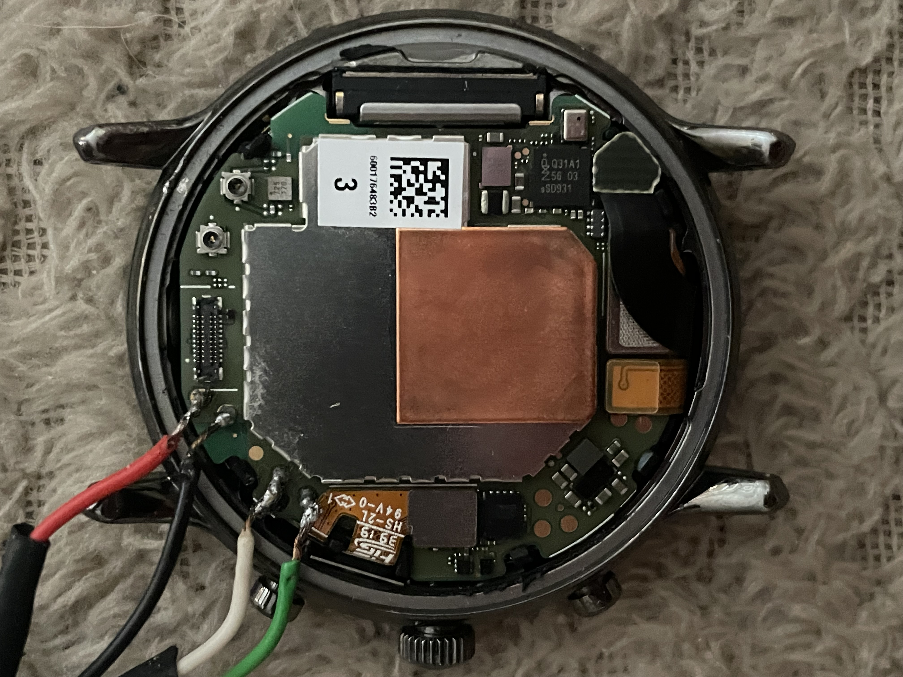

# Fossil Gen 5 (triggerfish / Carlyle HR) install guide

| | |
|---|---|
| SoC | Qualcomm **Snapdragon Wear 3100**: the same **APQ8009W** quad Cortex-A7 as the Gen 4, plus a **QCC1110 "BG" co-processor** that owns the crown, the always-on display mode and the audio codec. Run bare-metal in AArch32, dual core (core 1 renders), cores 2 and 3 off. Deep sleep = cluster power collapse + RPM XO shutdown |
| PMIC | **PM660** over SPMI (not the Gen 4's PM8916): fuel gauge, waveform haptics, RTC, rails |
| Display | 416×416 AMOLED, MSM DSI **command mode** (MDP3 DMA_P pipe takeover, as on the Gen 4) |
| Touch | Raydium (I²C, BLSP1 QUP5 @ `0x39`), same controller and bus as the Gen 4 |
| Crown | **Working (v273, 2026-09-12).** There is no PixArt sensor: the QCC1110 co-processor reports crown rotation as one signed count per detent over its SPI link, and the firmware loads the co-processor, brings the link up and enables the crown itself about 40 s after boot (see [Device-specific notes](#device-specific-notes)) |
| Heart rate | PixArt PAH8011 (I²C @ `0x15`), **not answering yet** on this port |
| Charger | SMB1357 on I²C; PM660 fuel gauge (GEN3) for the battery |
| Modem | **Booted by the firmware** (Hexagon MSS, with the host QMI services it expects). The boot happens behind a loading screen. Also carries the audio DSP the speaker path runs on |
| Speaker | **Not working** Driven through the modem's audio DSP over primary TDM to the QCC1110 co-processor, which commands the NXP TFA9897 amplifier. Enabled with `-DAUDIO_TDM_MASTER`; see [The speaker](#the-speaker) |
| Storage | eMMC via sdhci-msm: NVS (Preferences) + FFat + log file inside `userdata`, with the same "leave a Wear OS volume alone" rule as the Gen 4 |
| Toolchain | **Bare-metal + FreeRTOS**, no Arduino IDE |
| Status | **Working** display, touch, crown, vibration, USB log console, WiFi (WPA2, DHCP, NTP, HTTP/HTTPS), BLE, deep sleep (~6 mA class), co-processor, modem. **Not yet** heart rate, the co-processor's display channel |

> **This is not an Arduino build.** There is no IDE, no board package and no
> Upload button. The firmware is a bare-metal ARM image with its own FreeRTOS
> runtime, compiled by a shell script and flashed with `fastboot` as an Android
> boot image. Nothing from the ESP32 boards carries over except the LVGL
> libraries.

> **You do not have to overwrite Wear OS.** `fastboot boot` works on this
> watch: it loads the firmware into RAM and runs it, writing nothing. A power
> cycle returns you to stock. See
> [RAM boot](#option-a-ram-boot-recommended-nothing-is-written).

> ## The Gen 5 is a Gen 4 with a different PMIC and a second chip
>
> If you have read the [Gen 4 page](fossil-gen4.md), almost all of it applies
> here: same AP, same USB block, same eMMC, same touch controller, same
> WCNSS radio, same fastboot and RAM-boot flow. What is different:
>
> - **The DTB is not interchangeable.** aboot matches the appended device tree
>   on `board-id` and `pmic-id`, and triggerfish differs from firefish on both.
>   Pack with `dtbs/triggerfish-stock.dtb` or the image is rejected before a
>   single instruction runs ("dtb not found", harmless but confusing).
> - **Two vendor blobs must come from your own watch**: the WiFi NV table
>   (from `persist`) and the co-processor firmware (`bgapp` + `bg-wear`, from
>   the `modem` partition's FAT image). Neither is in this repo.
> - **The PM660** changes the rail table, the haptics driver, the fuel gauge
>   and the sleep sequence. All of it is done; you just need to know it is why
>   Gen 4 images will not run here.

---

## Before you start

The recovery ladder does not depend on the firmware being sane:

- **Reboot to fastboot**: the way in, described under [Enter fastboot](#2-enter-fastboot).
- **Hold the power button**: the watch switches off.
- **EDL (9008) + QFIL**: the last-resort unbrick, never needed so far.

Because the normal test cycle is a RAM boot that writes nothing, a bad image
costs you a power cycle rather than a recovery operation.

> **Never flash `aboot`, `sbl1`, `tz`, `rpm`, `modem` or `persist`.** Only
> `boot` is ours. `persist` holds this unit's calibration and its MACs and is
> irreplaceable; `modem` holds the co-processor firmware, and the watch cannot
> use its crown without it.

---

## Host tools you need

**Android SDK platform-tools**: the package that provides `adb` and `fastboot`.

### Linux

```sh
sudo apt install android-sdk-platform-tools fastboot     # Debian / Ubuntu
```

If your distribution does not package it, download the **SDK Platform-Tools for
Linux** zip from <https://developer.android.com/tools/releases/platform-tools>,
extract it, and run the commands on this page from inside that folder.

> **Arch-based distributions:** install the AUR package
> **`android-sdk-platform-tools`**, *not* the repo package `android-tools`.
>
> ```sh
> yay -Sy android-sdk-platform-tools
> ```

### Windows

Use **WSL (Debian/Ubuntu)** and follow the Linux instructions. Building the
image yourself requires a Linux environment in any case. You will also need
`usbipd` to pass the watch's USB connection through to WSL; the
[Gen 6 page](fossil-gen6.md#2-enter-fastboot) walks through that step.

### For building only

| Tool | Used by |
|---|---|
| `mtools` (`mcopy`) | `tools/mk-bgfw.sh`, to lift the co-processor firmware out of the modem partition's FAT image |
| `python3` | the boot-image packer and the NV blob generator |

### Check it works

```sh
adb version
fastboot --version
```

---

## Part 1: Getting an image

### Option A: download a prebuilt image

Grab the Fossil Gen 5 `.img` from the [GitHub releases page](../../../../releases)
and skip to [Part 2: Flashing](#part-2-flashing).

> A published image carries **no WiFi NV table and no co-processor firmware**
> unless the release notes say otherwise: both are vendor files taken from a
> specific watch. Without them WiFi and the crown stay off; everything else
> works. To get them you build, see below.

### Option B: build it yourself

#### Prerequisites

| Thing | Where / how |
|---|---|
| ARM toolchain | `arm-none-eabi-gcc` on your `PATH` (Arm GNU 14.2.Rel1 in use) |
| Python3, mtools | see [Host tools](#for-building-only) |
| LVGL | this repo's `libraries/lvgl` (auto-detected), or `~/Arduino/libraries/lvgl` |
| DTB | `snapdragon-port/dtbs/triggerfish-stock.dtb`, **in this repo** |
| Your watch's `persist` files | `WCNSS_qcom_wlan_nv.bin` and `wifimac.ini`, for WiFi |
| Your watch's `modem` partition image | for the co-processor firmware |

#### Step 1: the vendor blobs (once per watch)

Both live in a per-watch directory named after the fastboot serial, for example
`snapdragon-port/firmware/gen5-C3F9453E4746/`. It is gitignored. The build
script picks the first `firmware/gen5-*` directory that has a `wcnss_nv.c`, or
the one named in `OWF_GEN5_FW`, and prints which one it used.

**WiFi NV table.** Pull the two files from `persist` (rooted shell, or a dump
of the partition mounted on the host) and run:

```sh
sh snapdragon-port/tools/mk-wcnss-nv.sh WCNSS_qcom_wlan_nv.bin none gen5-<serial>
```

Pass `none` as the MAC source for any image you will ever hand to someone else;
see [Publishing an image](#publishing-an-image-strip-your-mac-first). Passing
`wifimac.ini` instead bakes your own MAC in, which is fine for a private build.

**Co-processor firmware.** From a dump of the `modem` partition (a FAT image,
about 64 MB):

```sh
cd snapdragon-port/baremetal
sh tools/mk-bgfw.sh ../firmware/gen5-<serial>/emmc/gen5-modem.img ../firmware/gen5-<serial>
```

This copies `bgapp.mdt+b00..b03` (the signed TrustZone app that does the
loading, 35 812 bytes) and `bg-wear.mdt+b00..b02` (the co-processor image,
693 524 bytes) out of `::/image/` and writes them into `bg_fw.c`. The build
compiles it in automatically and prints
`[owf] BG firmware blobs from ../firmware/gen5-<serial>`. Without it the log
says `bgload: no bg_fw.c compiled in` and the co-processor stays off.

#### Step 2: build

Two commands, and the second one's DTB is the Gen 5's own:

```sh
cd snapdragon-port/baremetal

# 1. compile + link (release flag set)
OWF_PUBLIC=1 CFLAGS_EXTRA="-DWDOG_TRACE -DSLEEP_NO_WDOG -DSYS_PC_8909 -DSYS_PC_STAGE=6 -DL2_SAW_AP_ENABLE -DSYS_PC_XO_SHUTDOWN -DMSS_BOOT -DMSS_PROXY_VOTES -DMSS_OPEN_MASK=0x7F -DAUDIO_TDM_MASTER" sh build-owf-image-gen5.sh

# 2. pack into an Android boot image with the triggerfish DTB appended
sh tools/mk-bootimg-gen5.sh build/gen5-owf/owf.bin

ls build/gen5/       # result: build/gen5/owf-boot.img
```

`mk-bootimg-gen5.sh` defaults to `../dtbs/triggerfish-stock.dtb` and the
stock load addresses (kernel `0x80008000`, page size 2048). If you pass a DTB
explicitly, pass **that** one; the Gen 4's is rejected by aboot on this watch.

> **`-DWDOG_TRACE` is load-bearing.** aboot hands over with the APPS watchdog
> armed, and this flag is the only thing that compiles the watchdog pet into
> the main loop. Without it the watch warm-resets into Wear OS a few seconds
> into every boot, which looks exactly like "the image never ran".

> **The flag set above is the release set.** `-DWDOG_TRACE` alone boots and
> runs but sleeps with the core merely clock-gated; the five sleep flags turn
> that into the cluster collapse. They are the same flags as the Gen 4's and
> are explained under [Build flags](#build-flags).

#### Publishing an image: strip your MAC first

The build embeds `wcnss_nv.c` when you have one, and if you generated it from
`wifimac.ini` it contains **your** watch's MAC. Publish that build and every
watch that flashes it transmits your address.

Build release images with `OWF_PUBLIC=1` (as in the command above). That
removes the `wcnss_mac` symbol from the object entirely and the firmware
derives a locally-administered MAC per device from the eMMC CID instead. The
boot log says which it used:

```
wlan: MAC 02:xx:xx:xx:xx:xx (derived per device from the eMMC CID)
```

The NV table itself stays in the image. It is board calibration data and
contains no MAC. Whether you may redistribute it, or the co-processor
firmware, is a licensing question; the prebuilt images in this repo's releases
do not carry either unless stated.

---

## Part 2: Flashing

### 1. Connect the watch: how to wire USB to the Gen 5

The Gen 5 charger puck does not give a usable data link on its own. The pads
next to the board-to-board connector on the back of the main board do:

<p align="center">
  
</p>

| Pad | Wire |
|---|---|
| 5V | red, the pad beside the connector |
| GND | black, next to it |
| D− | white, the pad further down the board edge |
| D+ | green, the pad below that, next to the flex |

Power is the pair of pads at the top edge beside the connector; data is the
pair further down the left edge, by the small flex. Route the cable out past
the case and refit the back loosely. If the watch does not enumerate, clean
the pads with isopropyl alcohol; on the unit this port was developed on, one
stubborn enumeration failure was cleared by a plain reboot of the watch.

> Standard USB colours are used throughout: **red = 5 V (VBUS)**, **black = GND**,
> **white = D−**, **green = D+**. A plain USB 2.0 cable with the device end cut
> off is all it takes; keep the D+/D− leads short and twisted. The pads are
> small: a fine tip, thin solder and flux, and check every joint for bridges
> with a multimeter before plugging in. Swapped D+/D− shows as the watch never
> enumerating; swapped power will destroy the watch.

### 2. Enter fastboot

From Wear OS with USB debugging enabled:

```sh
adb reboot bootloader
fastboot devices        # should list the watch
```

### 3. Unlock the bootloader

Required once, before you can flash **or RAM-boot** anything.

```sh
fastboot oem unlock
```

**This wipes user data**, which is expected. Confirm on the watch if it prompts.

> **Do not re-lock the bootloader afterwards.** A locked bootloader may refuse
> to boot an unsigned image, and you lose the ability to flash a fix. I take no
> responsibility if you brick your hardware or lose data.

### 4. Back up your original installation

On this watch the backup is not optional if you want WiFi or the crown: the
blobs in [Step 1](#step-1-the-vendor-blobs-once-per-watch) come from it.

Wear OS is not rooted, so you need a boot image with a root shell that
**aboot will accept for triggerfish**. There is no TWRP for the Gen 5, and the
Gen 4's images are rejected by board-id. What works is
[AsteroidOS](https://asteroidos.org/)'s own Gen 5 boot image from
<https://release.asteroidos.org/>: RAM-boot it and it gives you a root `adb`
shell without flashing anything.

```sh
fastboot boot asteroid-<gen5-codename>-boot.img
adb shell id                 # should report uid=0(root)
```

Then dump:

```sh
mkdir -p triggerfish-stock-backup && cd triggerfish-stock-backup
for p in boot recovery persist modem misc; do
  adb shell "dd if=/dev/block/bootdevice/by-name/$p" > gen5-$p.img
done
adb pull /persist/WCNSS_qcom_wlan_nv.bin
adb pull /persist/wifimac.ini
```

Check the results are real (`ls -l *.img`, none should be 0 bytes) before
trusting them. `persist` is the irreplaceable one. Restore the firmware later
with `fastboot flash boot gen5-boot.img`.

### 5. Run it

#### Option A: RAM boot (recommended, nothing is written)

```sh
fastboot boot owf-fossil-gen5.img
```

The firmware runs immediately. **Nothing is written to any partition** and a
power cycle returns the watch to stock. This is the normal way to test, and
every version in this port's history was brought up this way.

#### Option B: permanent install (`boot` partition)

Only when you want the firmware to survive a reboot. **This replaces Wear OS.**

```sh
fastboot flash boot owf-fossil-gen5.img
fastboot reboot
```

---

## Using it

### Reading the log over USB

Once the firmware is running, the USB connection becomes a serial console (a
CDC-ACM device streaming the firmware log). It is not `adb`.

```sh
cat /dev/ttyACM0
```

The whole ring buffer is replayed when you connect, so you get everything
printed since boot even if you plugged in late.

> The UART is deliberately disabled (`PLAT_UART_DISABLED`), as on the Gen 4:
> reading a clock-gated MSM block hangs the AHB. The USB console is the log.

### The co-processor

About 35 s after boot the firmware brings the QCC1110 up. The log block starts
with `bgload:` and ends with

```
bgload: bg2ap-status gpio97 HIGH after 0 ms -- BG IS RUNNING
bgload: GET_BG_VERSION (after load) ... version="06.14_rel_FML_..."
```

The delay is not arbitrary: the co-processor's two rails are voted through the
RPM, and that channel is not open until the radio stack has settled. The full
sequence is rails, handshake pins, SPI mux and clocks, PMIC reset line,
TrustZone app, metadata authentication, then the image download.

### First run

- **Set the clock** manually or from WiFi.
- **Storage leaves Wear OS alone.** If `userdata` still holds a Wear OS volume,
  storage stays read-only for that boot and the log says so. For a real
  install, erase the partition once and the next boot creates the firmware's
  own volume:

  ```sh
  fastboot erase userdata
  ```
- **Deep sleep** is the same cluster collapse as on the Gen 4, adapted to the
  PM660: the L2 sequencer, the CPU rail's voltage set and the RTC alarm gating
  all differ from the PM8916 watches and are handled. The wake log prints
  `rpm-masters[post-resume] APSS shutdowns=N xo=N` as proof the RPM took part.
- **WiFi and BLE** behave as on the Gen 4: WPA2 STA, DHCP, NTP, HTTPS,
  NimBLE pairing. The radio idles resident through sleep.

---

## Build flags

Everything is **silent by default**; failures always print.

### Recommended (what the release images are built with)

```
CFLAGS_EXTRA="-DWDOG_TRACE -DSLEEP_NO_WDOG -DSYS_PC_8909 -DSYS_PC_STAGE=6 -DL2_SAW_AP_ENABLE -DSYS_PC_XO_SHUTDOWN -DMSS_BOOT -DMSS_PROXY_VOTES -DMSS_OPEN_MASK=0x7F -DAUDIO_TDM_MASTER"
```

| Flag | What it does |
|---|---|
| `-DWDOG_TRACE` | Pets the APPS watchdog from the main loop. **Load-bearing.** |
| `-DSLEEP_NO_WDOG` | One uninterrupted collapse until the button or the RTC alarm, watchdog stopped for its duration. |
| `-DSYS_PC_8909` | The system power collapse: L2/cluster off through the SAW sequence, TrustZone warm boot, RPM sleep set. |
| `-DSYS_PC_STAGE=6` | Cluster level 6 = the kernel's `l2-pc`. 7 = `l2-gdhs` is the fallback. |
| `-DL2_SAW_AP_ENABLE` | L2 SAW in retention while awake, as the shipped kernel does. |
| `-DSYS_PC_XO_SHUTDOWN` | Drops the crystal vote so the RPM can enter XO shutdown. |

### The modem

| Flag | What it does |
|---|---|
| `-DMSS_BOOT` | Loads and authenticates the modem image from the `modem` partition behind the loading screen, and runs the host services it needs (rmtfs, RFSA, memshare, sensor registry). |
| `-DMSS_PROXY_VOTES` | Holds the modem's CX/MX and bus votes through the RPM for the duration of the load, and releases them when the modem signals proxy-unvote. Without it the rails drop mid-load. |
| `-DMSS_OPEN_MASK=0x7F` | Which SMD channels to open toward the modem, one bit each: 0 `apr_audio_svc`, 1 `fastrpcsmd-apps-dsp`, 2 `DIAG_2_CMD`, 3 `DIAG_2`, 4 `DIAG_CNTL`, 5 `DIAG_CMD`, 6 `DIAG`. `0x7F` opens all seven. |

`-DMSS_OPEN_MASK=0x7F` depends on the FastRPC default-listener registration: the
firmware attaches to the sensor PD, opens `adsp_default_listener` through
`remotectl`, registers it, and then services the listener loop. With all seven
channels open but no listener, the modem's own sensor daemon blocks and the
subsystem watchdog fires a few tens of seconds in. Narrower masks such as `0x03`
are historical — they were a way to avoid that stall before the listener existed.

### The speaker

| Flag | What it does |
|---|---|
| `-DAUDIO_TDM_MASTER` | Brings up the speaker path: the primary TDM group (`0x9100`, ports `0x9000/0x9002/0x9004/0x9006`), the `PRI_TDM_IBIT` bit clock at 3.072 MHz (48 kHz x 4 slots x 16 bits), and the internal frame sync. |

The audio backend itself is selected by the board header rather than a flag:
`BOARD_HAS_AUDIO_Q6` in `OpenWatchFace/board_fossil_gen5.h` routes the app's
notification and timer sounds through the modem's audio DSP and the QCC1110
co-processor's codec, which drives the NXP TFA9897 amplifier. The PCM path is
ASM to ADM to AFE port `0x9002` (`PRI_TDM_RX_1`), mono, 48 kHz, 16-bit, in TDM
slot 1; the co-processor is commanded over the GLINK `CODEC_CHANNEL`.

`-DAUDIO_TDM_MASTER` requires `-DMSS_BOOT`, since the audio DSP lives on the
modem. Building it without the modem flags compiles the audio path out.

### Load-bearing

| Flag | What happens without it |
|---|---|
| `-DWDOG_TRACE` | Nothing pets the APPS watchdog and **the watch warm-resets into Wear OS a few seconds into every boot.** |

### Do **not** pass

These appear on the Gen 4 or C2 pages but do not apply to this watch:

| Flag | Why not |
|---|---|
| `-DDISPLAY_BISECT` | Its stage table was proven on the **Gen 6** and silently disables the part of the watchdog staircase you would need here. |
| `-DSLEEP_RAILS_OFF` | Its rail table and restore voltages are the PM8916's (C2/S2). The Gen 5 has a PM660, so the votes would switch the wrong rails. |
| `-DSLEEP_BATT_DIAG` | Suspends an SMB231 charger input. The Gen 5 has no SMB231 — it charges through the PM660's own SMB2 block, so this flag does nothing. |
| `-DCROWN_DIAG` | Probes a PixArt PAT9126. There is no PixArt sensor on this watch; the crown arrives over the co-processor's SPI link. Use `-DLOG_VERBOSE` for crown tracing instead. |

### Experimental / measurement flags

The sleep and bring-up flags are the Gen 4's; see its
[experimental list](fossil-gen4.md#experimental--measurement-flags). None of them
are in the release images.

### Diagnostics

The diagnostic flags are the Gen 4's; see its
[Diagnostics](fossil-gen4.md#diagnostics). One Gen 5 addition:

| Flag | Brings back |
|---|---|
| `-DLOG_VERBOSE` | as on the Gen 4, plus the co-processor bring-up narration (QUP register snapshots after each TrustZone command, PMIC reset-line reads) |

### What the script sets for you

`CFLAGS_EXTRA` is *added to* a fixed set that `build-owf-image-gen5.sh` puts on
every compile line. You never pass these and you cannot omit them, but they are
worth knowing when you read a build log or compare two images:

| Define | Set where | What it selects |
|---|---|---|
| `-DPLAT_BOARD_FOSSIL_GEN5` | every C and C++ TU | Pulls in `baremetal/boards/fossil_gen5.h`, which is what chooses the PM660 blocks over the Gen 4's PM8916 ones — the haptics waveform player, the FG-GEN3 gauge and SMB2 charger, the CPU rail, the SPMI slave ids. |
| `PLAT_HAS_ROTARY_CROWN` | Set by the board header, not the script. The co-processor's RSB (crown) bring-up is opt-in: a board that does not declare it never runs it, because forcing it on a watch with no crown to turn crashes the boot. |
| `-DBOARD_SELECT=BOARD_ID_FOSSIL_GEN5` | C++ / the app only | Picks `OpenWatchFace/board_fossil_gen5.h`. The app never sees the `PLAT_` headers, so the board has to be named twice, once on each side. |
| `-DUSE_CPU_PC_8909` | every TU | Compiles the CPU power-collapse entry points. The board headers are invisible to `arduino_main.cpp`, so this cannot live in a header. |
| `-DLV_CONF_INCLUDE_SIMPLE` | every TU | LVGL takes its config from this repo's `lv_conf.h`. |
| `-DOWF_APP` | `main.c` only | Builds the real app entry instead of `ui_demo.c`. |
| `-DHAVE_BG_FW` | every TU, **conditional** | Added automatically when `firmware/gen5-*/bg_fw.c` exists. Without it `bg_load.c` compiles to a stub and the co-processor — so the crown — stays off. The build prints which of the two it did. |

### Environment variables

| Variable | Default | Effect |
|---|---|---|
| `OWF_PUBLIC` | unset (`0`) | `1` strips `wcnss_mac` from the NV object; see [Publishing](#publishing-an-image-strip-your-mac-first). Use it for anything you hand to someone else. |
| `CFLAGS_EXTRA` | empty | The flag set above. **Empty means a watch that warm-resets every few seconds** — `-DWDOG_TRACE` lives here, not in the script. |
| `OWF_GEN5_FW` | first `../firmware/gen5-*` with a `wcnss_nv.c` | Which watch's vendor blobs to compile in. The build prints the directory it picked. |
| `LVGL_DIR` | this repo's `libraries/lvgl`, else `~/Arduino/libraries/lvgl` | Where LVGL comes from. |
| `CROSS` | `arm-none-eabi-` | Toolchain prefix. |

> **LVGL is cached per build directory.** `build/gen5-owf/liblvgl-owf.a` is built
> once and reused; changing `LVGL_DIR` or an LVGL config afterwards has no
> effect until you delete it.


---

## Troubleshooting

| Symptom | Cause / fix |
|---|---|
| `fastboot boot` fails with *dtb not found* | Wrong or missing DTB. Use `mk-bootimg-gen5.sh`, which appends `triggerfish-stock.dtb`; the Gen 4's tree is rejected on this watch. Nothing ran, nothing was damaged. |
| Watch resets into Wear OS a few seconds into every boot | Built without `-DWDOG_TRACE`. |
| `bgload: no bg_fw.c compiled in` | You have not run `tools/mk-bgfw.sh`, or the `firmware/gen5-*` directory it wrote to is not the one the build picked (the build prints which). |
| `bgload: pm660_l3 ... rc=4294967295` repeatedly | The RPM channel was not open yet; the firmware retries for two seconds. If it never succeeds, the radio stack did not come up and the RPM SMD channel with it. |
| `bgload:` shows `IMAGE_LOAD ... status -2` then `DLOAD_CONT` | Normal. The co-processor's bootloader reports itself in reset after power-on and the app is told to continue the download. |
| `wlan:` never appears | No `wcnss_nv.c` in the firmware directory. WiFi needs your watch's own NV table; see Step 1. |
| Every fastboot command hangs after you interrupted one | Never kill `fastboot` mid-transfer. Unplug and replug to clear it. |
| Watch seems dead / hung | Hold power to switch off, then re-enter fastboot. A RAM-booted image cannot brick anything. |

---

## Device-specific notes

- **The DTB in this repo is this watch's own.** `triggerfish-stock.dts/.dtb`
  was dumped from the stock boot partition of serial C3F9453E4746, and the
  recovery partition carries a byte-identical copy. Every pin, rail and address
  in `snapdragon-port/baremetal/boards/fossil_gen5.h` is transcribed from it,
  never from another vendor's tree.
- **Why the co-processor took ten images to start.** Everything on the AP side
  (rails, mux, clocks, reset line, TrustZone app load, metadata authentication)
  was verified correct early, and the chip stayed silent. The load command was
  returning "ok" in one millisecond without moving a byte. Disassembling the
  vendor's TrustZone app showed it reads a 12-byte request (three 32-bit
  words) while the kernel header *appears* to declare a 9-byte packed one; GCC
  ignores a packing attribute placed before the `struct` keyword, so Linux had
  always sent 12. The second half was a missing cache clean on the metadata
  buffer. With both fixed the chip answered on the first try.
- **The crown, end to end.** Crown rotation and the pushers arrive as frames on
  the co-processor's SPI FIFO link (bgcom). Over that link a GLINK transport
  carries the `RSB_CTRL` channel; the firmware acknowledges the co-processor's
  nine channel announcements, opens RSB_CTRL, sends configure and enable (with
  PM660 l11 and l15 voted on), and from then on every detent is one signed
  count into the same crown path the Gen 4 uses. Scroll lists with it; roll it
  down on the watchface for the quick shade. Feel is tuned in
  [`OpenWatchFace/board_fossil_gen5.h`](../../OpenWatchFace/board_fossil_gen5.h).
  The other channels the co-processor announced (display-ctrl, display-data,
  CODEC_CHANNEL) are the path to always-on display and audio, not yet used.
- **Heart rate.** The PAH8011 is the same sensor and address as on the Wear
  2100 watches, on a different interrupt pin. It does not answer on either of
  the two candidate I²C pin pairs yet; the working theory is an unpowered
  sensor rail.
- **Storage** was enabled on 2026-09-10 (v247) and follows the Gen 4 rules
  exactly: a Wear OS volume in `userdata` is never touched.
