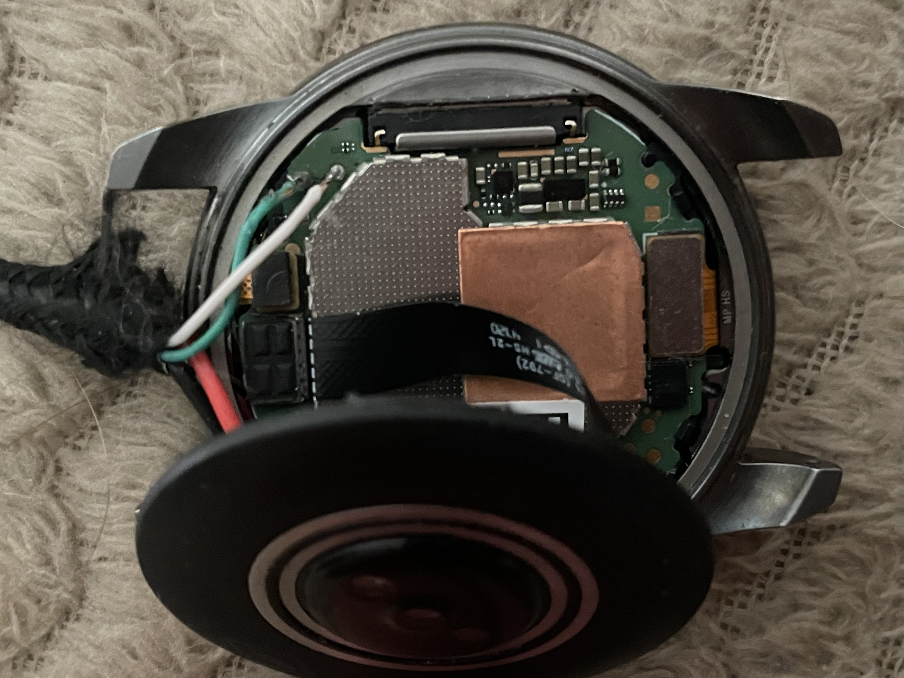

# Fossil Gen 5E (sole) install guide

| | |
|---|---|
| SoC | Qualcomm **Snapdragon Wear 3100**: **APQ8009W** quad Cortex-A7 plus the **QCC1110 "BG" co-processor**, the same platform as the [Gen 5](fossil-gen5.md). Run bare-metal in AArch32, dual core (core 1 renders), cores 2 and 3 off. Deep sleep = cluster power collapse + RPM XO shutdown |
| PMIC | **PM660** over SPMI: fuel gauge, waveform haptics, RTC, rails |
| Display | **390×390** AUO AMOLED (`qcom,mdss_dsi_auo_390p_amoled_cmd`), MSM DSI command mode, MDP3 DMA_P pipe takeover |
| Touch | Raydium 390p firmware (I²C, BLSP1 QUP5 @ `0x39`). Same controller family as the Gen 5 but a **different firmware**: it has no "display mode" host command, and sending it flips the frame. Handled in the board header |
| Crown | **None.** The 5E has a plain pusher, not a rotating crown. The pusher works as the Gen 5's crown *press* |
| Heart rate | PixArt PAH8011, **not answering yet** (as on the Gen 5) |
| Charger | PM660 SMB2 block; PM660 fuel gauge (GEN3) for the battery |
| Modem | **Booted by the firmware** (Hexagon MSS, with the host QMI services it expects). The boot happens behind a loading screen; see [The loading screen](#the-loading-screen) |
| Speaker | **Not working** Driven through the modem's audio DSP over primary TDM to the QCC1110 co-processor, which commands the NXP TFA9897 amplifier. Enabled with `-DAUDIO_TDM_MASTER`.
| Storage | eMMC via sdhci-msm: NVS (Preferences) + FFat + log file inside `userdata`, with the same "leave a Wear OS volume alone" rule as the Gen 4 |
| Toolchain | **Bare-metal + FreeRTOS**, no Arduino IDE |
| Status | **Working** display, touch, pusher, vibration, USB log console, WiFi, BLE, deep sleep, loading screen with fastboot fallback, flashed to `boot`, modem. **Not yet** heart rate, the co-processor (left off on this board), modem sleep on the Wear 3100 family (still under work) |

> **This is not an Arduino build.** The firmware is a bare-metal ARM image with
> its own FreeRTOS runtime, compiled by a shell script and flashed with
> `fastboot` as an Android boot image.

> **You do not have to overwrite Wear OS.** `fastboot boot` works on this
> watch: it loads the firmware into RAM and runs it, writing nothing. A power
> cycle returns you to stock.

> ## The 5E is a Gen 5 with a smaller panel and no crown
>
> Read the [Gen 5 page](fossil-gen5.md) first: same AP, PMIC, USB block, eMMC,
> WCNSS radio, fastboot and RAM-boot flow. What is different:
>
> - **The DTB is not interchangeable.** aboot matches the appended device tree
>   on `board-id`, and sole is `<8 0x1e>` where triggerfish is `<8 0x15>`. A
>   Gen 5 image is refused with "dtb not found" before a single instruction
>   runs. Pack with `dtbs/sole-stock.dtb` (in this repo).
> - **390×390 panel**, so the app is built with its own board header and font
>   set (`BOARD_ID_FOSSIL_GEN5E`).
> - **No rotating crown.** This watch has a pusher, and the co-processor's crown
>   bring-up crashed a flashed boot here, so that channel is compiled out
>   (`PLAT_NO_ROTARY_CROWN`). The co-processor itself **is** loaded.
> - **Touch firmware differs**: reset timings, a settle window after reset,
>   and the display-mode command is never sent. All in `boards/fossil_gen5e.h`.

---

## Before you start

The recovery ladder does not depend on the firmware being sane:

- **Reboot to fastboot**: `adb reboot bootloader` from Wear OS, or hold the
  pusher while the watch powers on.
- **From the firmware's loading screen**: press the pusher **five times within
  three seconds** while the spinner is showing. The watch reboots straight
  into fastboot. This is the way out of a bad image flashed to `boot`.
- **Hold the power button**: the watch switches off.
- **EDL (9008) + QFIL**: the last-resort unbrick, never needed so far.

> **Never flash `aboot`, `sbl1`, `tz`, `rpm`, `modem`, `modemst1/2`, `fsg` or
> `persist`.** Only `boot` is ours. `persist` holds this unit's calibration
> and MACs; `modem` and the `modemst`/`fsg` file systems are what the modem
> boots from.

---

## Host tools you need

**Android SDK platform-tools** (`adb`, `fastboot`). Same as the
[Gen 5 page](fossil-gen5.md#host-tools-you-need): `apt install
android-sdk-platform-tools fastboot` on Debian/Ubuntu, the AUR
`android-sdk-platform-tools` on Arch, WSL + `usbipd` on Windows.

For building: `arm-none-eabi-gcc`, `python3`, and optionally `dtc` (the
packer uses `fdtget` to refuse a DTB with the wrong board-id).

```sh
adb version
fastboot --version
```

---

## Part 1: Getting an image

### Option A: download a prebuilt image

Grab the Fossil Gen 5E `.img` from the [GitHub releases page](../../../../releases)
and skip to [Part 2: Flashing](#part-2-flashing).

> A published image carries **no WiFi NV table** unless the release notes say
> otherwise. Without it WiFi stays off; everything else works.

### Option B: build it yourself

#### Prerequisites

| Thing | Where / how |
|---|---|
| ARM toolchain | `arm-none-eabi-gcc` on your `PATH` (Arm GNU 14.2.Rel1 in use) |
| LVGL | this repo's `libraries/lvgl` (auto-detected), or `~/Arduino/libraries/lvgl` |
| DTB | `snapdragon-port/dtbs/sole-stock.dtb`, **in this repo** |
| Your watch's `persist` files | `WCNSS_qcom_wlan_nv.bin` and `wifimac.ini`, for WiFi |
| `mtools` (`mcopy`) | `tools/mk-bgfw.sh`, to lift the co-processor firmware out of the modem partition's FAT image |
| Your watch's `modem` partition | a dump of it, for the co-processor blobs (Step 1) |

#### Step 1: the WiFi NV table (once per watch)

Vendor files live in a per-watch directory named after the fastboot serial,
for example `snapdragon-port/firmware/gen5e-K4F3040524A0679/`. It is
gitignored. The build script picks the first `firmware/gen5e-*` directory that
has a `wcnss_nv.c`, or the one named in `OWF_GEN5E_FW`, and prints which.

Pull the two files from `persist` (see [Back up](#4-back-up-your-original-installation))
and run:

```sh
sh snapdragon-port/tools/mk-wcnss-nv.sh WCNSS_qcom_wlan_nv.bin none gen5e-<serial>
```

Pass `none` as the MAC source for any image you will ever hand to someone
else. Passing `wifimac.ini` instead bakes your own MAC in, fine for a private
build.

**Co-processor firmware.** The speaker runs through the QCC1110, so this board
needs its blobs. From a dump of the `modem` partition (a FAT image, about 64 MB):

```sh
cd snapdragon-port/baremetal
sh tools/mk-bgfw.sh ../firmware/gen5e-<serial>/emmc/gen5e-modem.img ../firmware/gen5e-<serial>
```

This lifts `bgapp` (the signed TrustZone app that does the loading) and
`bg-wear` (the co-processor image) out of `::/image/` and writes them into
`bg_fw.c`. The build compiles it in and prints
`[owf] BG firmware blobs from ../firmware/gen5e-<serial>`. Without them the
co-processor has nothing to load.

#### Step 2: build

```sh
cd snapdragon-port/baremetal

# 1. compile + link (release flag set)
OWF_PUBLIC=1 CFLAGS_EXTRA="-DWDOG_TRACE -DSLEEP_NO_WDOG -DSYS_PC_8909 -DSYS_PC_STAGE=6 -DL2_SAW_AP_ENABLE -DSYS_PC_XO_SHUTDOWN -DMSS_BOOT -DMSS_PROXY_VOTES -DMSS_OPEN_MASK=0x7F -DAUDIO_TDM_MASTER" sh build-owf-image-gen5e.sh

# 2. pack into an Android boot image with the sole DTB appended
sh tools/mk-bootimg-gen5e.sh build/gen5e-owf/owf.bin

ls build/gen5e/       # result: build/gen5e/owf-boot.img
```

`mk-bootimg-gen5e.sh` defaults to `../dtbs/sole-stock.dtb` and the stock load
addresses (kernel `0x80008000`, page size 2048). If `fdtget` is installed it
refuses any DTB whose board-id is not `8 1e`.

Read the `[owf]` lines of the build output: they say which NV blob was
compiled in, or that none was.

> **`-DWDOG_TRACE` is load-bearing.** Without it the watch warm-resets into
> Wear OS a few seconds into every boot.

#### Publishing an image: strip your MAC first

Build with `OWF_PUBLIC=1`, as above. It removes the `wcnss_mac` symbol and the
firmware derives a locally-administered MAC per device from the eMMC CID. The
NV table itself is board calibration data and contains no MAC.

---

## Part 2: Flashing

### 1. Connect the watch: how to wire USB to the Gen 5E

The 5E's charger puck does not carry USB data. Only the two data lines need
to go onto the board; power is easier to take from the charging contacts:

<p align="center">
  
</p>

| Signal | Wire | Where |
|---|---|---|
| D+ | green | the pad to the right of the board-to-board connector |
| D− | white | the pad beside it |
| 5 V | red | the **inside** of the back cover, on the charging contact that reads as + |
| GND | black | the inside of the back cover, on the contact that reads as − |

Find the power pair with a multimeter first: put the watch on its charger,
probe the charging contacts on the outside of the back cover to see which one
is + and which is −, then solder the red and black leads to the **inside** of
the back cover on those same contacts. Solder only the green and white leads
to the board. If the watch does not enumerate, check D+/D− are not swapped.

> Standard USB colours are used throughout: **red = 5 V (VBUS)**, **black = GND**,
> **white = D−**, **green = D+**. A plain USB 2.0 cable with the device end cut
> off is all it takes; keep the D+/D− leads short and twisted. The pads are
> small: a fine tip, thin solder and flux, and check every joint for bridges
> with a multimeter before plugging in. Swapped D+/D− shows as the watch never
> enumerating; swapped power will destroy the watch.

### 2. Enter fastboot

From Wear OS with USB debugging enabled:

```sh
adb reboot bootloader
fastboot devices        # should list the watch; `fastboot getvar product` says "sole"
```

### 3. Unlock the bootloader

Required once, before you can flash **or RAM-boot** anything.

```sh
fastboot oem unlock
```

**This wipes user data.** Do not re-lock the bootloader afterwards. I take no
responsibility if you brick your hardware or lose data.

### 4. Back up your original installation

Wear OS is not rooted and there is no TWRP for the 5E. What works is a boot
image with a root shell that **aboot accepts for sole**, RAM-booted so nothing
is written. AsteroidOS does not publish a sole image; the way that worked was
to repack an AsteroidOS Wear 3100 boot image with the sole DTB appended and a
small enough DTB pile that aboot still loads it (the ramdisk must stay at
`0x02000000`). With a root `adb` shell:

```sh
adb shell id                 # should report uid=0(root)
mkdir -p sole-stock-backup && cd sole-stock-backup
adb shell "cat /proc/partitions; ls -l /dev/block/bootdevice/by-name" > partmap.txt
adb shell "dd if=/dev/block/mmcblk0" > gen5e-emmc-full.img      # whole eMMC, ~3.8 GB
adb shell "md5sum /dev/block/mmcblk0"; md5sum gen5e-emmc-full.img   # must match
adb pull /persist/WCNSS_qcom_wlan_nv.bin
adb pull /persist/wifimac.ini
```

Carve individual partitions from the full image with the GPT it contains (any
GPT tool works; `sgdisk -p gen5e-emmc-full.img` lists them). `boot` is what
you flash back to return to Wear OS:

```sh
fastboot flash boot gen5e-boot.img
```

### 5. Run it

#### Option A: RAM boot (recommended, nothing is written)

```sh
fastboot boot owf-fossil-gen5e.img
```

#### Option B: permanent install (`boot` partition)

Only when you want the firmware to survive a reboot. **This replaces Wear OS.**

```sh
fastboot flash boot owf-fossil-gen5e.img
fastboot reboot
```

If the flashed image misbehaves, the five-press fallback on the loading
screen gets you back to fastboot without a working OS.

---

## Using it

### The loading screen

The first thing on the glass is a spinner. During it the firmware loads the
modem (MBA authentication, then the segment files, staged in RAM), serves the
modem's file-system and registry requests, pets the watchdog and streams the
log over USB. The OS starts about eight seconds after the modem reports
ready, or after the loader gives up. Five pusher presses within three seconds
during the spinner reboot to fastboot.

### Reading the log over USB

Once the firmware is running, the USB connection is a CDC-ACM serial console
streaming the firmware log. It is not `adb`.

```sh
cat /dev/ttyACM0
```

The ring buffer is replayed on connect. The UART is disabled on this board.

### First run

- **Set the clock** manually or from WiFi.
- **Storage leaves Wear OS alone.** If `userdata` still holds a Wear OS
  volume, storage stays read-only for that boot. For a real install:

  ```sh
  fastboot erase userdata
  ```
- **Deep sleep** turns WiFi and BLE fully off for the duration of every sleep
  and restores them on wake if they were on.
- **Undervolt** settings survive a Power-app power-off or a reboot to
  fastboot, and reset after a crash or forced power-off.

---

## Build flags

Everything is **silent by default**; failures always print.

### Recommended (what the release images are built with)

```
CFLAGS_EXTRA="-DWDOG_TRACE -DSLEEP_NO_WDOG -DSYS_PC_8909 -DSYS_PC_STAGE=6 -DL2_SAW_AP_ENABLE -DSYS_PC_XO_SHUTDOWN -DMSS_BOOT -DMSS_PROXY_VOTES -DMSS_OPEN_MASK=0x7F -DAUDIO_TDM_MASTER"
```

The first six are the Gen 5's and are explained on
[its page](fossil-gen5.md#recommended-what-the-release-images-are-built-with).

### The modem


| Flag | What it does |
|---|---|
| `-DMSS_BOOT` | Loads and authenticates the modem image from the `modem` partition behind the loading screen, and runs the host services it needs (rmtfs, RFSA, memshare, sensor registry). |
| `-DMSS_PROXY_VOTES` | Holds the modem's CX/MX and bus votes through the RPM during the load and releases them afterwards. |
| `-DMSS_OPEN_MASK=0x7F` | Which SMD channels to open toward the modem, one bit each: 0 `apr_audio_svc`, 1 `fastrpcsmd-apps-dsp`, 2 `DIAG_2_CMD`, 3 `DIAG_2`, 4 `DIAG_CNTL`, 5 `DIAG_CMD`, 6 `DIAG`. `0x7F` opens all seven. |

Opening all seven channels depends on the FastRPC default-listener registration:
the firmware attaches to the sensor PD, opens `adsp_default_listener` through
`remotectl`, registers it, and then services the listener loop. With the channels
open but no listener the modem's sensor daemon blocks and the subsystem watchdog
fires a few tens of seconds in — which is why the narrower `0x03` mask was used
before the listener existed.

### The speaker

| Flag | What it does |
|---|---|
| `-DAUDIO_TDM_MASTER` | Brings up the speaker path: the primary TDM group (`0x9100`, ports `0x9000/0x9002/0x9004/0x9006`), the `PRI_TDM_IBIT` bit clock at 3.072 MHz (48 kHz x 4 slots x 16 bits), and the internal frame sync. |

`BOARD_HAS_AUDIO_Q6` in `OpenWatchFace/board_fossil_gen5e.h` selects the backend
and routes the app's notification and timer sounds through the modem's audio DSP
and the co-processor's codec to the NXP TFA9897 amplifier. The PCM path is ASM to
ADM to AFE port `0x9002` (`PRI_TDM_RX_1`), mono, 48 kHz, 16-bit, in TDM slot 1.

`-DAUDIO_TDM_MASTER` requires `-DMSS_BOOT`, since the audio DSP lives on the modem.

### Load-bearing

| Flag | What happens without it |
|---|---|
| `-DWDOG_TRACE` | Nothing pets the APPS watchdog and **the watch warm-resets into Wear OS a few seconds into every boot.** |

### Do **not** pass

The Gen 5's list applies unchanged: see [its Do not pass table](fossil-gen5.md#do-not-pass).
In short: `-DDISPLAY_BISECT`, `-DSLEEP_RAILS_OFF` (PM8916 rail table, this is a
PM660 watch), `-DSLEEP_BATT_DIAG` (no SMB231) and `-DCROWN_DIAG` (no PixArt crown).

### Experimental / measurement flags

The Gen 4's; see its [experimental list](fossil-gen4.md#experimental--measurement-flags).
None of them are in the release images.

### Diagnostics

The Gen 5's; see its [Diagnostics](fossil-gen5.md#diagnostics).

### What the script sets for you

`build-owf-image-gen5e.sh` adds these to every compile line:

| Define | What it selects |
|---|---|
| `-DPLAT_BOARD_FOSSIL_GEN5 -DPLAT_BOARD_FOSSIL_GEN5E` | `boards/fossil_gen5e.h`, which wraps the Gen 5 header and overrides the panel size, the touch timings, the touch display-mode command and the crown. |
| `-DPLAT_NO_ROTARY_CROWN` | Suppresses the co-processor's RSB (crown) bring-up. The bring-up is opt-in — a board runs it only if it declares `PLAT_HAS_ROTARY_CROWN` — but this board's header wraps the Gen 5's and would otherwise inherit it, so the override is explicit here. |
| `-DBOARD_SELECT=BOARD_ID_FOSSIL_GEN5E` | `OpenWatchFace/board_fossil_gen5e.h` on the app side (390×390). |
| `-DUSE_CPU_PC_8909`, `-DLV_CONF_INCLUDE_SIMPLE`, `-DOWF_APP` | As on the Gen 5. |

### Environment variables

The Gen 5's ([table](fossil-gen5.md#environment-variables)), with `OWF_GEN5E_FW` in
place of `OWF_GEN5_FW`.

---

## Troubleshooting

| Symptom | Cause / fix |
|---|---|
| `fastboot boot` fails with *dtb not found* | Wrong DTB. Use `mk-bootimg-gen5e.sh` with `sole-stock.dtb`; the Gen 5's tree is refused on this watch. Nothing ran. |
| Watch resets into Wear OS a few seconds into every boot | Built without `-DWDOG_TRACE`. |
| Flashed to `boot` it crashes during boot, RAM boot works | Was the co-processor crown bring-up on a watch with no crown. The bring-up is now opt-in and this board overrides it with `PLAT_NO_ROTARY_CROWN`; if it still crashes, five pusher presses on the spinner take you to fastboot. |
| Touch lands in the wrong place, or the frame flips between boots | The firmware sent the Raydium display-mode command. `PLAT_TOUCH_NO_DISPLAY_MODE_CMD` must be set by the board header. |
| Touches with no finger right after boot | The 390p firmware reports a creeping phantom for a while after reset; the board header waits 600 ms and drops stuck points after 3 s. |
| `wlan:` never appears | No `wcnss_nv.c` in the firmware directory. See Step 1. |
| Console reconnects every few seconds during the spinner | The bulk-IN endpoint stalls on some USB hosts; the firmware flushes and re-enumerates by itself. It settles once the OS is up. |
| Every fastboot command hangs after you interrupted one | Never kill `fastboot` mid-transfer. Unplug and replug. |

---

## Device-specific notes

- **The DTB in this repo is this watch's own.** `sole-stock.dts/.dtb` was
  dumped from the boot partition of serial K4F3040524A0679: model "Fossil
  Group, Inc. based on APQ8009W-PM660 BG Alpha SDW3100", `qcom,board-id
  <8 0x1e>`, `qcom,msm-id <0x109 0x20000 0x12d 0x20000>`.
- **Sensor registry.** The modem's sensor hub reads its registry over QMI from
  the host. The firmware serves it from `platform/sns_reg_gen5e.h`, generated
  with `tools/gen_snsreg.py` from the `persist` `sns.reg` file and the group
  table in the vendor `sensors.qti` library.
- **Touch.** The raw Raydium frame is correct on this panel with no flip or
  rotation, once the display-mode command is withheld. Earlier attempts at
  a 180° rotation or a Y flip were chasing that bug.
- **Co-processor.** The QCC1110 is loaded on this board: the speaker path runs
  through it, so it is needed for audio. An early bring-up attempt on one unit
  saw `bg2ap-status` stay low and its crown channel crash a flashed boot, which
  is what the retired `-DPLAT_NO_BG_COPROC` define worked around. If you hit
  that, check that the co-processor firmware blobs were compiled in — the build
  prints `[owf] BG firmware blobs from ...`, and without them the link has
  nothing to load. The crown channel is not used here regardless; this board has
  a pusher, and `-DPLAT_NO_ROTARY_CROWN` stays.
